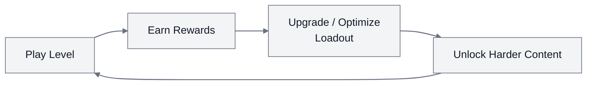

# 1. Core Loop

## 1.1 Core Loop

Each run asks the player to clear a short stage, earn rewards, invest those rewards into Aircraft/Wingman/Device or related progression systems, then push into harder content. The differentiator is how many investment surfaces the game attaches to it: Aircraft, Wingman, Device, Engine, Promote/Certify, VIP, Quests, Events, and PvP attempts.

## 1.2 Session Flow

Typical short session:

Open App → Check Daily Hooks → Choose Mode → Play 1-3 Attempts → Claim Rewards → Upgrade If Possible → Continue or Exit

This session structure is built for quick mobile play: the player can enter action fast, make progress in a few minutes, and stop at a natural breakpoint after a result screen or upgrade decision.

| Session element | Design purpose |
|-----------------|----------------|
| Fast entry | Reduces friction before the first battle |
| 1-3 attempts | Fits short mobile sessions |
| Result + reward | Gives closure after each run |
| Upgrade prompt | Converts rewards into visible power growth |
| Continue/exit point | Lets the player stop without feeling lost |
| Daily/event hooks | Creates a reason to return later |

## 1.3 Game Modes

### Single-Player Modes

| Mode | Role in loop | Notes |
|------|--------------|-------|
| Campaign | Main progression path | 900+ levels, 3 difficulty tiers per mission. Core place where players clear stages, earn gold/materials, and hit upgrade gates. |
| Daily Missions | Resource farming / daily hook | Refresh regularly, provide specific resources, upgrade points, and currency. Drives daily return. |
| Boss Fights | Skill check / damage test | Dedicated boss-only challenges. Tests DPS output and bullet-hell evasion. |
| Sea Battlefield | Late-game expansion | Unlocks at Career Rank 25. Adds Battleship unit with its own upgrade path. |

### Multiplayer & Competitive Modes

| Mode | Role in loop | Notes |
|------|--------------|-------|
| Eliminate (PvP) | Competitive tension / score chase | Real-time multiplayer skirmishes against other players. |
| Last Stand | Endurance / survival | Survival-style multiplayer (formerly "Last Man Standing"). Tests evasion and endurance against relentless waves. |

### Co-op & Clan Modes

| Mode | Role in loop | Notes |
|------|--------------|-------|
| United We Stand (Co-op) | Social / cooperative | Team up with other players to take down difficult targets and massive bosses. |
| Squadron Challenges | Clan retention / exclusivity | Team-based tasks and tournaments for clan members. Exclusive group rewards. |
| Time-Limited Events | FOMO / liveops | Rotating events (e.g. Black Market) with unique challenges and resources. |

### Mode Design Observation

Modes reuse same shooting core but vary goal and social context. Campaign = progress, Daily = farm, Boss = skill check, PvP = compete, Co-op = social, Events = FOMO. This lets one control scheme support many retention hooks without new mechanics.

## 1.4 PvP & Competitive Design

PvP modes (Eliminate, Last Stand) are listed in 1.3. Detailed competitive system info (matchmaking, ranking, reward structure) is not publicly documented. PvP adds competitive motivation beyond campaign progression but uses the same shooting core.
