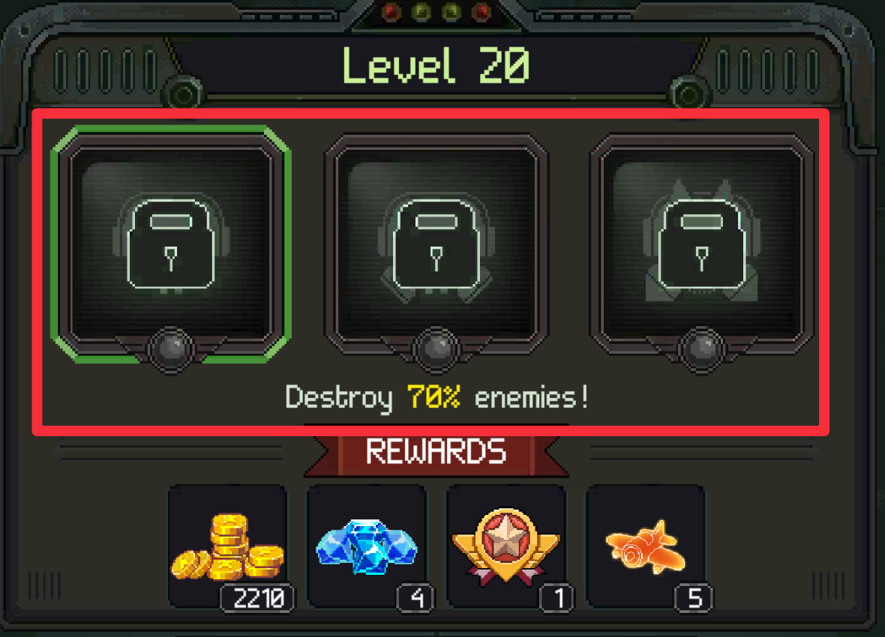
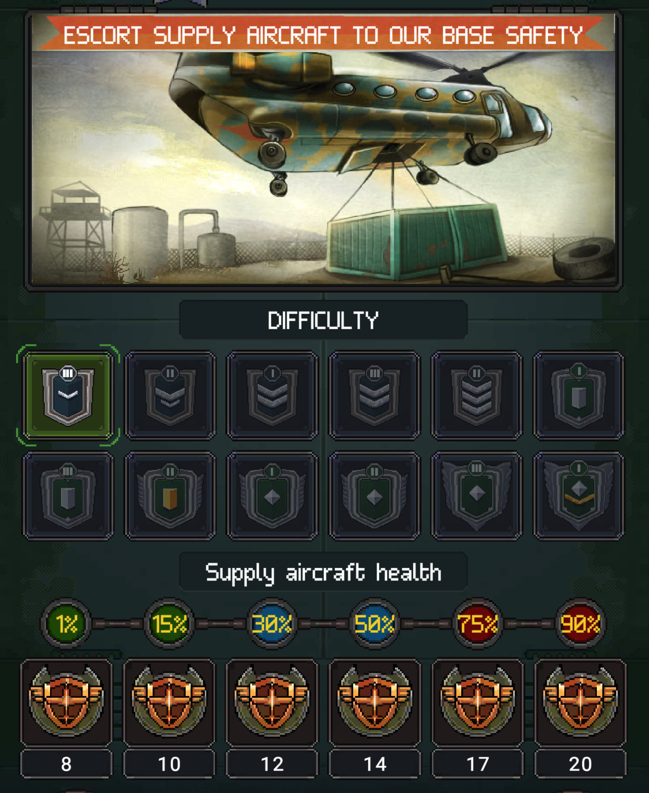

# 2. Core Mechanics

## 2.1 Controls & Combat Feel

Core combat is built around one-thumb movement with auto-fire. Player does not manage a fire button — attention stays on positioning and bullet avoidance.
Two movement modes:

| Mode | How it works | Use case |
|------|-------------|----------|
| **Drag** | Hold and drag finger, aircraft follows finger position | Continuous dodging, precise micro-movement |
| **Tap-to-move** | Tap a point on screen, aircraft moves to that position | Quick repositioning, jumping to safe spot |

Both modes keep the same auto-fire behavior. The control scheme removes execution complexity from shooting and concentrates difficulty into spatial awareness.

Verified observations:

- Finger placed on aircraft does not fully obscure it — player can still see the plane while dragging.
- **Hitbox is smaller than sprite**: only the fuselage counts as a hit target, wings do not take damage. This lets players weave through bullets that graze the wings — feels satisfying and reduces frustration.

## 2.2 Damage & HP Model

| Mechanic | How it works |
|----------|-------------|
| Player HP | HP bar on top of screen, scales with aircraft level/upgrade |
| Death | HP reaches 0 — can revive via ad (limited uses) or spend gems to continue |
| Fail state | No revives left — run ends |

### Win Conditions

Win conditions vary by mode:

| Mode | Win condition | Rating |
|------|--------------|--------|
| Campaign | Destroy % of enemies | 70%/80%/90% → 1/2/3 stars |
| Escort | Keep supply aircraft alive | Reward scales with remaining health % |
| Other missions | Varies per mode | Needs verification |

### In-Battle HUD

## 2.3 Bullet Patterns

Bullet patterns scale with campaign progression — not by adding new controls, but by increasing density and complexity:

| Stage | Pattern types | Player skill required |
|-------|--------------|----------------------|
| Early levels | Straight shots, simple V-shaped fans | Basic dodge timing, ample safe space |
| Mid levels | Cascading spirals, sweeping wheel patterns | Circular movement, reading rotation speed |
| Advanced levels | Overlapping walls, laser sweeps, missile swarms | Pixel-perfect positioning, memorization |

### Dodge Mechanics

Patterns repeat in predictable cycles. Survival relies more on memorization than reflexes — watching firing sequences to learn where gaps appear.

### Damage Types

Player weapons have damage types: Piercing, Explosive, Crushing, Shocking. Matching damage types across aircraft, wingman, and device maximizes DPS. This connects to unit loadout strategy (see 03_content, section 3.4).

## 2.4 Power-Ups & Pickups

Power-ups are temporary in-match items that change the rhythm of a run. Each level has fixed power-up placements — replaying the same level always spawns the same power-ups. Different levels offer different sets, so power-up availability is part of level design, not random.

| Power-up type | Player feeling | Design purpose |
|---------------|----------------|----------------|
| Shield | Safety / recovery | Survive a mistake or push through dense patterns |
| Damage boost | Power spike | Short burst of dominance, faster wave clear |
| Magnet | Convenience / reward capture | Reduces positioning friction for collecting drops |
| Nuclear / screen clear | Release / spectacle | Clears pressure, creates satisfying peak moment |

Power-ups interrupt pure survival pressure. They create micro-peaks: "I was under pressure, then I got a temporary advantage."
