# 3. Content

## 3.1 Aircraft

Aircraft is the main unit the player directly controls. 60+ aircraft in game. Differentiation comes mainly from **bullet type and skill** — all aircraft fire forward in a similar range, but what they shoot and what skill they carry defines their identity.


Each aircraft has base stats (ATK, HP), a star rating, and 4 damage types: Piercing, Explosive, Crushing, Shocking (see 02_core_mechanics.md, section 2.3).

### Aircraft Gear

Each aircraft has 7 gear slots — 4 offensive (top) and 3 defensive (bottom):

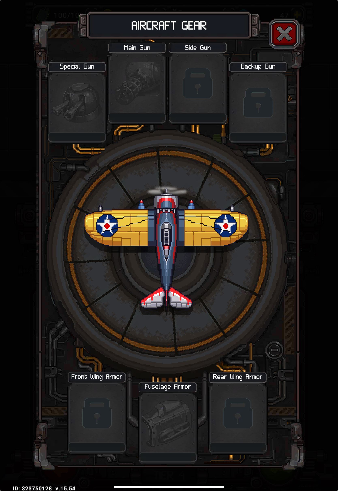

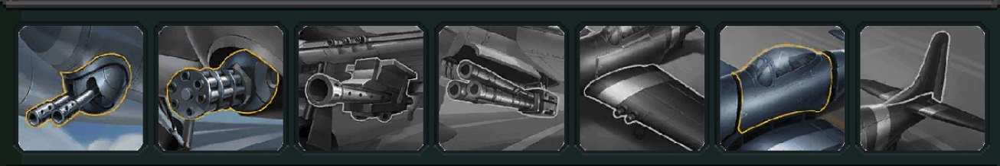

**Offensive (4 slots):**

| Slot | Stats |
|------|-------|
| Special Gun | Damage/Sec, Armor Piercing, Enhanced Accuracy, Critical Rate, Critical Multiplier |
| Main Gun | Damage/Sec, Armor Piercing, Enhanced Accuracy, Critical Rate, Critical Multiplier |
| Side Gun | Damage/Sec, Armor Piercing, Enhanced Accuracy, Critical Rate, Critical Multiplier |
| Backup Gun | Damage/Sec, Armor Piercing, Enhanced Accuracy, Critical Rate, Critical Multiplier |

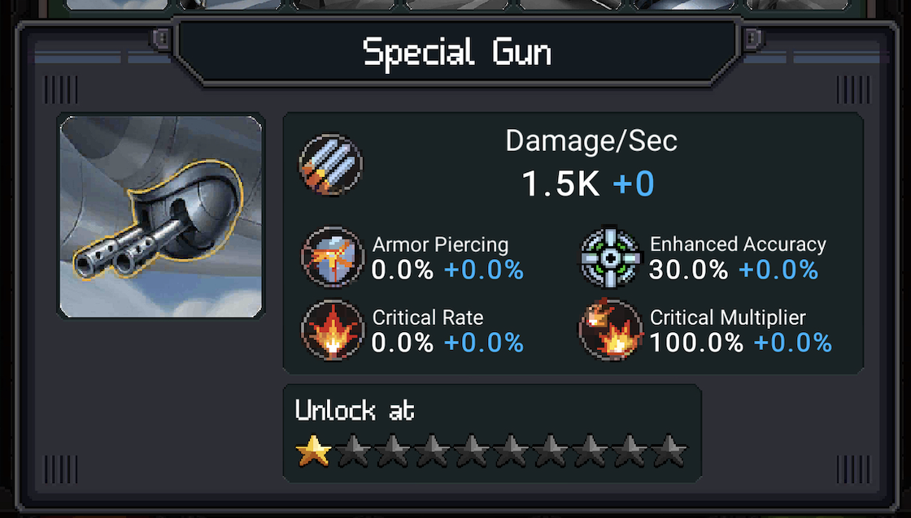

**Defensive (3 slots):**

| Slot | Stats |
|------|-------|
| Front Wing Armor | Health, Damage Reduction, Evasion Chance, Block Rate, Block Damage |
| Fuselage Armor | Health, Damage Reduction, Evasion Chance, Block Rate, Block Damage |
| Rear Wing Armor | Health, Damage Reduction, Evasion Chance, Block Rate, Block Damage |

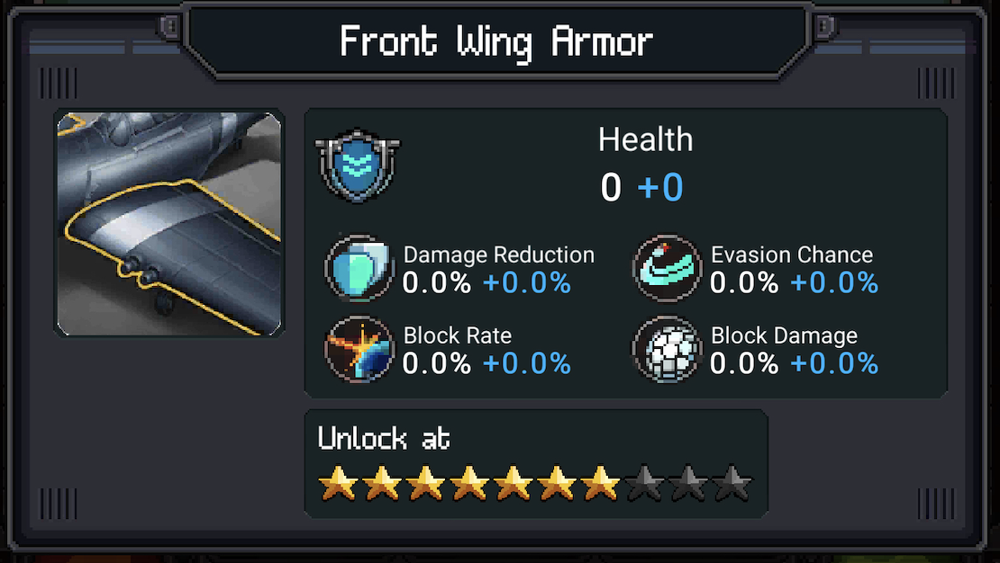

All gear slots unlock based on aircraft star level.

### Aircraft Engine

4 engine tiers, unlock based on aircraft star count. Example: "Battle Engine I" — when Aircraft is deployed into battle, increases all damage of Aircraft by 0.5% for every 5.0 second, to a maximum of 5.0% (also applied for Wingman and Device). Each level grants cascading bonuses to higher tier engines (1% → Tier 2, 0.5% → Tier 3, 0.25% → Tier 4). Unlocks at 2 stars.

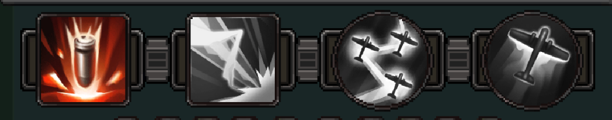

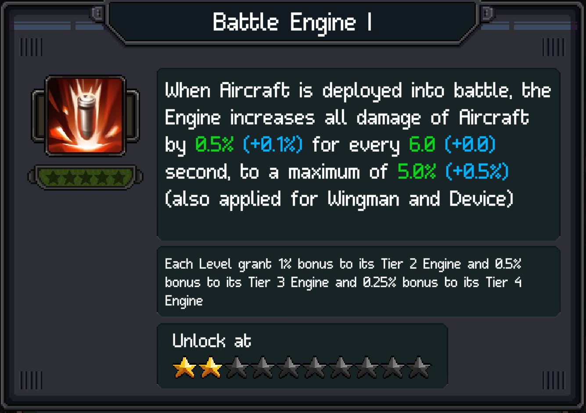

## 3.2 Wingman

Wingman is a support firing unit that flies alongside the aircraft. 2 wingman slots in the loadout. Does not replace the aircraft — adds extra weapon coverage to the player's damage footprint.

Example: **P47 Thunderbolt** — "The Jug – proved itself an unsung hero of World War II where it fought across all major theaters of the conflict.".


### Wingman Gear

Each wingman has 4 gear slots — 2 offensive + 2 defensive (simpler than aircraft's 7):

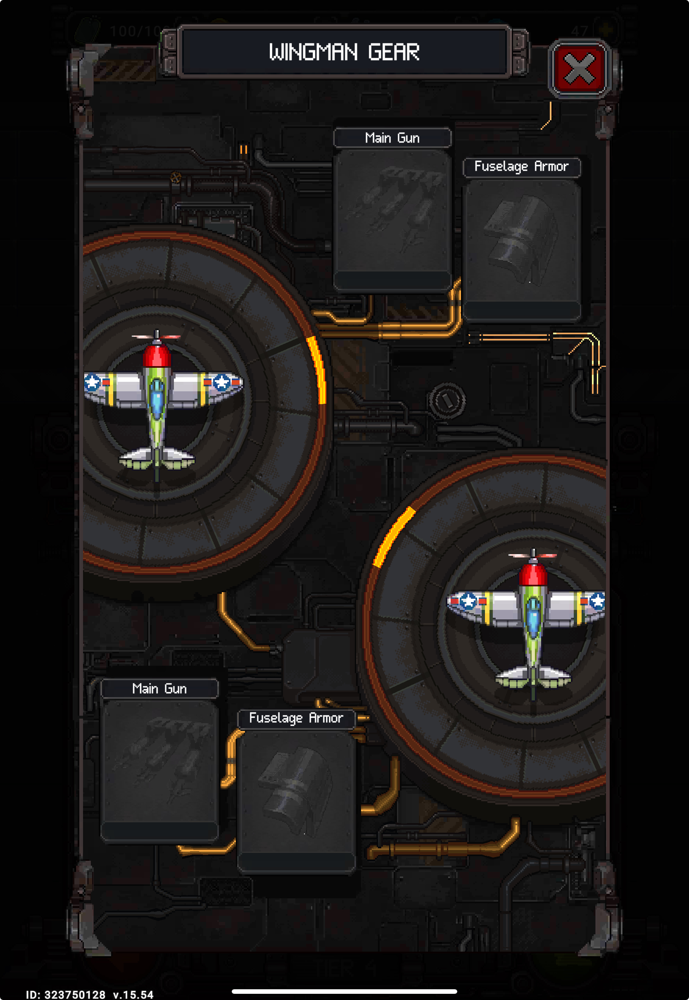

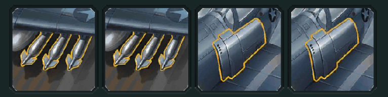

**Offensive (2 slots per wingman):**

| Slot | Stats |
|------|-------|
| Main Gun | Damage/Sec, Armor Piercing, Enhanced Accuracy, Critical Rate, Critical Multiplier |
| Main Gun | Damage/Sec, Armor Piercing, Enhanced Accuracy, Critical Rate, Critical Multiplier |

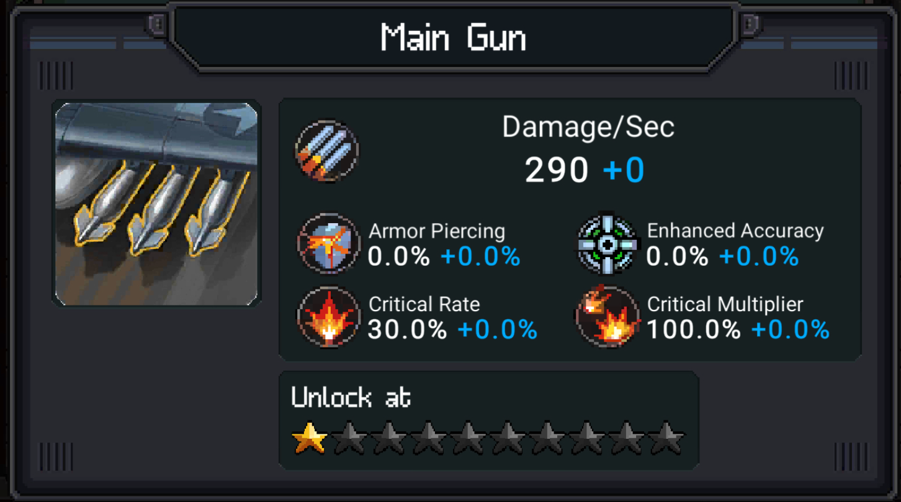

**Defensive (2 slots per wingman):**

| Slot | Stats |
|------|-------|
| Fuselage Armor | Health, Damage Reduction, Evasion Chance, Block Rate, Block Damage |
| Fuselage Armor | Health, Damage Reduction, Evasion Chance, Block Rate, Block Damage |

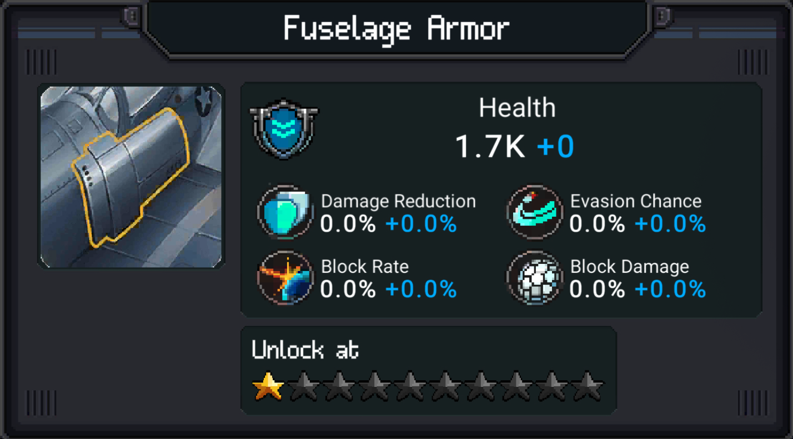

### Wingman Engine

2 engine slots per wingman (vs aircraft's 4). Wingman engines don't provide standalone buffs — instead they boost Aircraft's Battle Engine effectiveness. Example: "Battle Engine Enhancing" increases effectiveness of Battle Engine of Aircraft by 5.0%. Each level grants cascading bonuses to higher tier engines (1% → Tier 2, 0.5% → Tier 3, 0.25% → Tier 4). Unlocks at 2 stars.

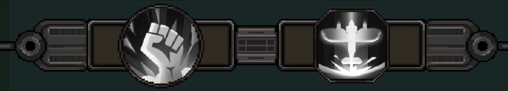

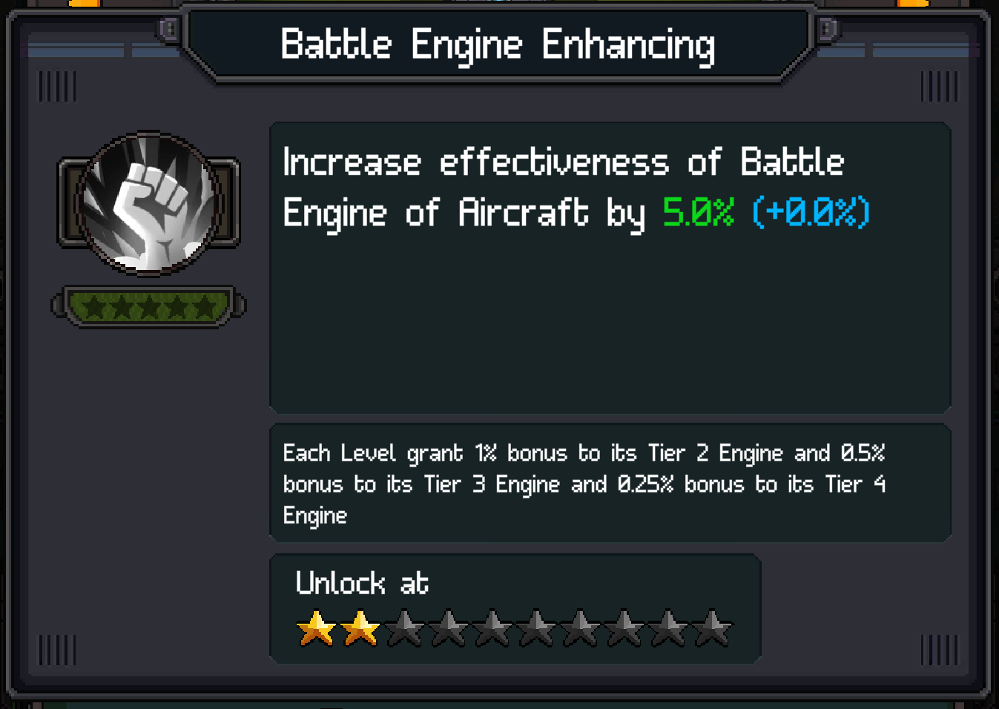

## 3.3 Device

Device is a support/equipment unit that provides utility or burst effects during battle. 1 device slot in the loadout.

Example: **Missiles Shroud** — "Launch a large wave of missiles to support in an emergency situation." 1 star.


### Device Gear

Each device has 3 gear slots — 1 offensive, 1 utility, 1 defensive. Only 2 out of 3 slots are unlocked by default across all devices:

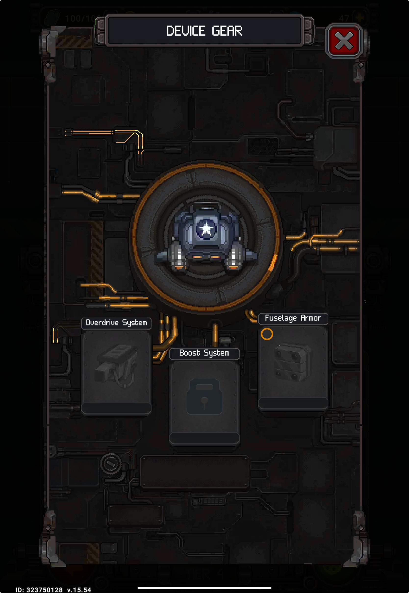

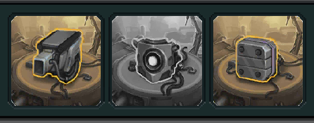

**Offensive (1 slot):**

| Slot | Stats |
|------|-------|
| Overdrive System | Damage/Sec, Armor Piercing, Enhanced Accuracy, Critical Rate, Critical Multiplier |

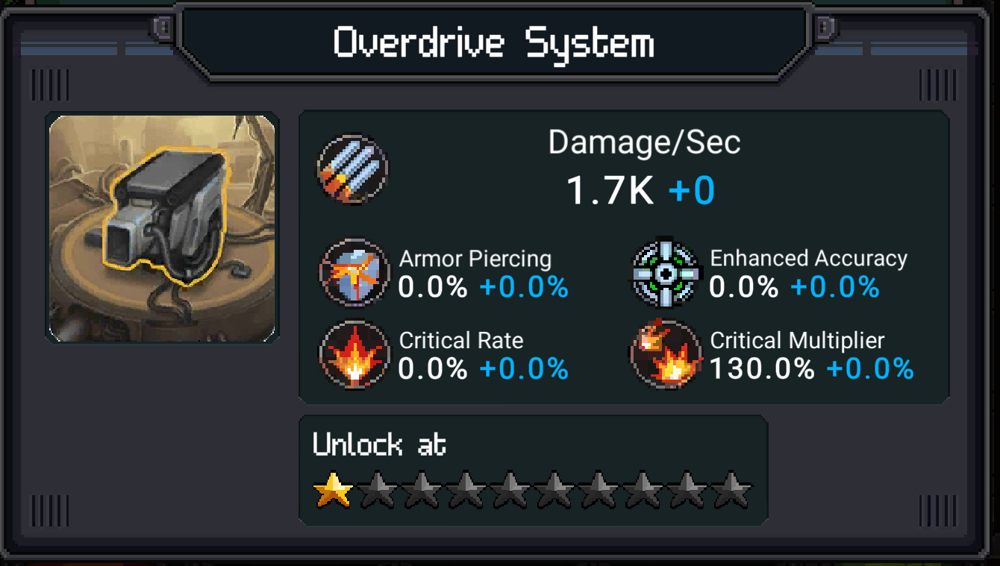

**Utility (1 slot):**

| Slot | Stats |
|------|-------|
| Boost System | Number of Block, Cooldown, Duration, Overclock Rate, Overclock Multiplier |

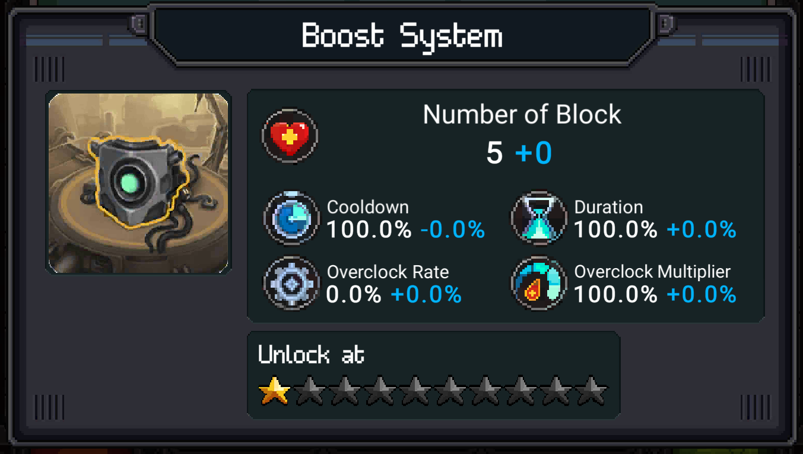

**Defensive (1 slot):**

| Slot | Stats |
|------|-------|
| Fuselage Armor | Health, Damage Reduction, Evasion Chance, Block Rate, Block Damage |

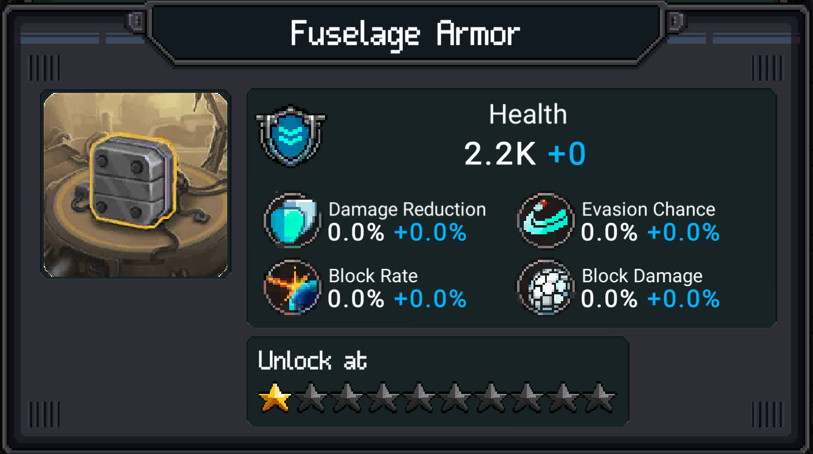

### Device Engine

2 engine slots per device. Same as Wingman — boosts Aircraft's Battle Engine effectiveness. Example: "Battle Engine Enhancing" increases effectiveness of Battle Engine of Aircraft by 5.0%. Each level grants cascading bonuses to higher tier engines (1% → Tier 2, 0.5% → Tier 3, 0.25% → Tier 4). Unlocks at 2 stars.

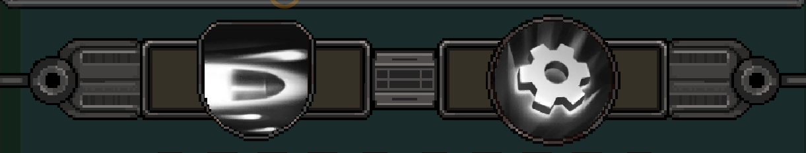

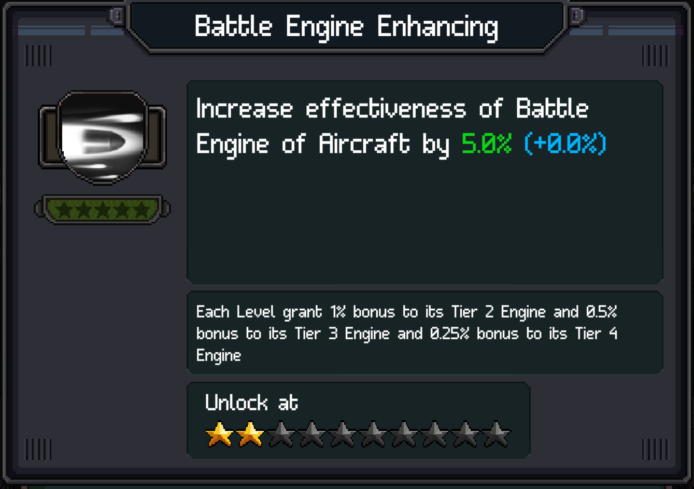

## 3.4 Co-pilot

Co-pilot is the fourth unit slot. Unlike Aircraft/Wingman/Device, Co-pilot is a character (person), not a vehicle or equipment. Provides stat boosts and activates support skills during battle.

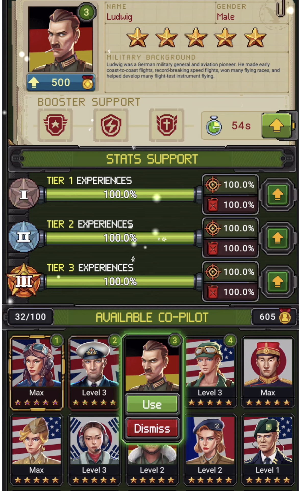

### Stats Boost

- HP boost — aircraft takes more hits before death
- Damage boost — faster enemy/boss kills

### Skills

Each co-pilot has a Booster Support skill that activates on a cooldown timer (e.g. 54s). Skill types vary per co-pilot — examples from research include auto-heal, shield, and critical damage burst, but exact skill list needs in-game verification.

### Specialization (Synergy)

Each co-pilot has a preferred Aircraft, Wingman, or Device. Matching co-pilot with their preferred unit grants a large bonus % to stats.

### Experience Tiers

Co-pilot has 4 experience tiers (Tier 1 / Tier 2 / Tier 3 / Tier 4) that provide stat support scaling.

## 3.5 Pilot

Pilot is the main character — the person flying the aircraft. Unlike the 4 unit slots (Aircraft/Wingman/Device/Co-pilot), Pilot is always present and has its own gear system.

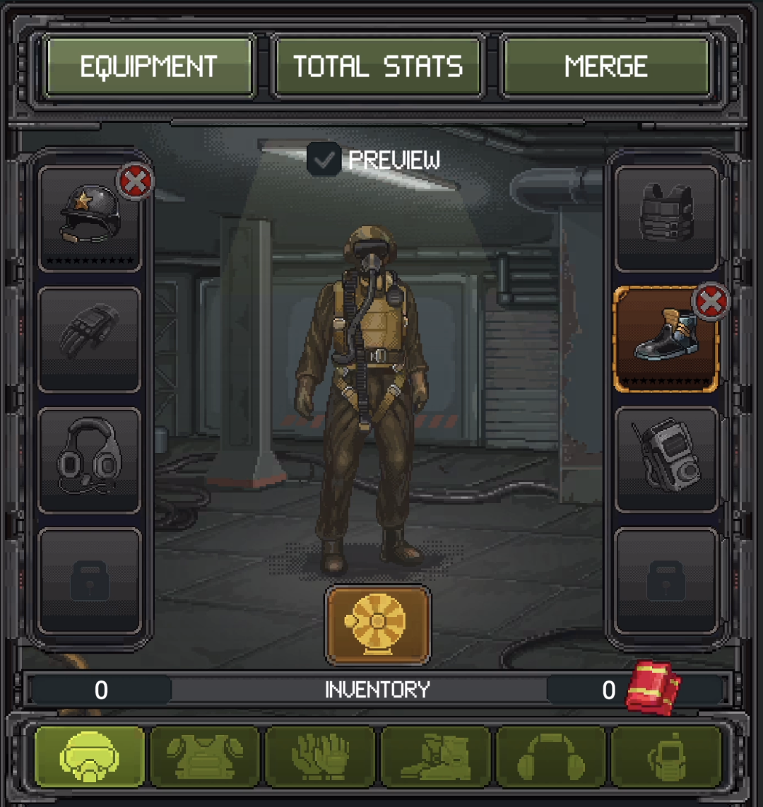

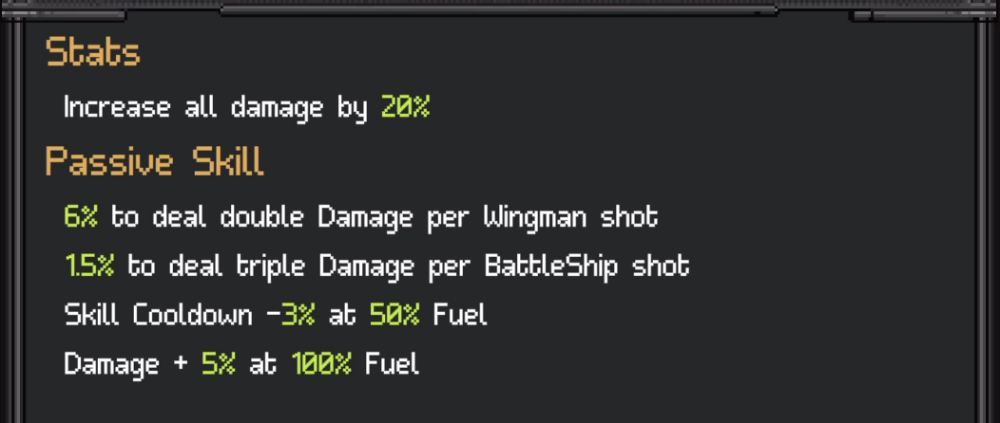

Pilot wears body equipment (helmet, gloves, shoes, backpack, walkie-talkie, etc.). Each piece provides stat boosts including rare multiplier stats (double/triple damage chance, skill cooldown reduction, fuel-conditional damage bonus) not available from other systems. Upgrade path uses Towels + Gems (see 04_progression, Pilot Gear Upgrade).

## 3.6 Unit Relationship

The squad/loadout has 4 unit slots + Pilot:

```text
Pilot     = main character, wears body gear (always present)
Aircraft  = main controlled unit + primary weapon
Wingman   = support fire + extra coverage
Device    = utility / burst support
Co-pilot  = passive stat boost + support skill
```

All units share the same sub-component structure:

| Component | Function |
|-----------|----------|
| Custom Gear | Equippable items that modify unit stats/behavior (3-4 slots) |
| Upgrade Engine | Engine upgrades for additional stat growth (2 slots) |
| Certificate | Advanced progression gate (see 04_progression) |

Squadron supports up to 4 loadout slots unlocked by account rank.

All 4 unit types use the same sub-component pattern, so players learn one system and apply it across the entire loadout.

## 3.7 Enemy Roles

Enemy design should be analyzed by role, not only by visual type:

| Enemy role | Function in level |
|------------|-------------------|
| Grunt | Low HP, fills screen, gives player easy kills and reward rhythm |
| Elite | Higher HP or denser attack, forces target priority |
| Special | Alters rules: homing, shield, suicide, support, heavy bullet pattern |
| Boss | Pattern-learning challenge and progression climax |

## 3.8 Wave & Stage Pacing

Stage structure:

```text
Opening wave -> low pressure, warm-up
Mid waves -> rising density, mixed enemies, power-up opportunities
Pre-boss wave -> pressure spike, fewer safety moments
Boss -> large target, repeated patterns, mastery check
```

Good shmup pacing alternates tension and relief. If every wave is high density, the player burns out; if every wave is easy, the player gets bored. 1945 uses bursts of pressure followed by short breathing room.

## 3.9 Boss Design

Bosses turn the game from "clear small waves" into "read a repeatable pattern under pressure."

### Boss 1 — Battleship (Early Campaign)

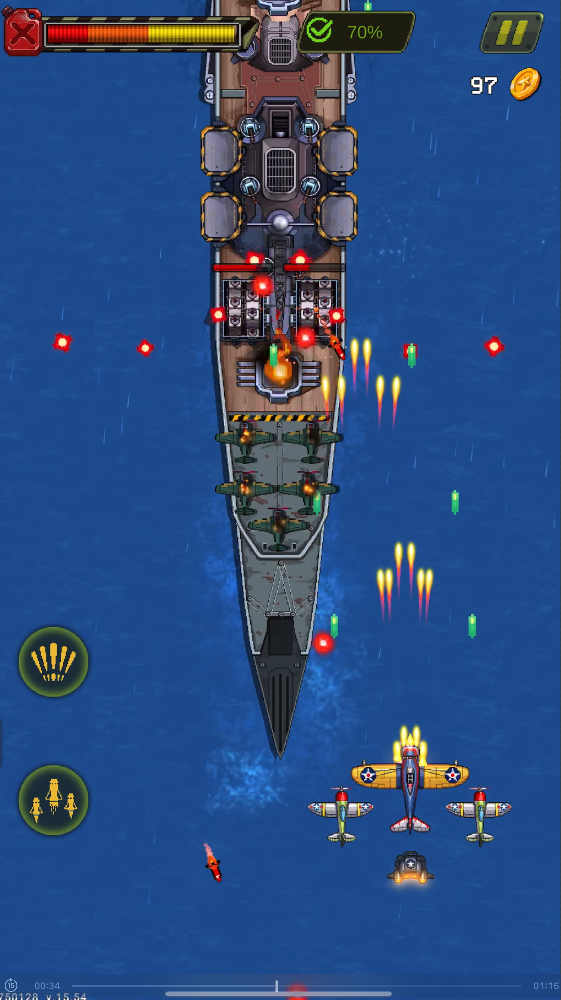

Large warship filling top half of screen. Multiple gun turrets clearly visible along the hull — player can identify where attacks originate.

**Attack patterns**: 2 types. Gun turrets fire red bullets in arc/spread patterns. Homing missiles occasionally launch toward player position — distinct red shape, trackable.

Turret positions are fixed, so player learns where bullets come from. Turrets can be destroyed individually, reducing attack density as the fight progresses. Player stays in bottom half, weaving between arc gaps while dodging missiles.

Early boss uses simple, readable patterns. Low complexity teaches player to read bullet origins and prioritize positioning — death feels like "I need to dodge better" not "I can't read what's happening."

### Boss 2 — Large Bomber (Level 20)

Large bomber aircraft — more complex than Boss 1, introduces phase transitions and layered attacks.

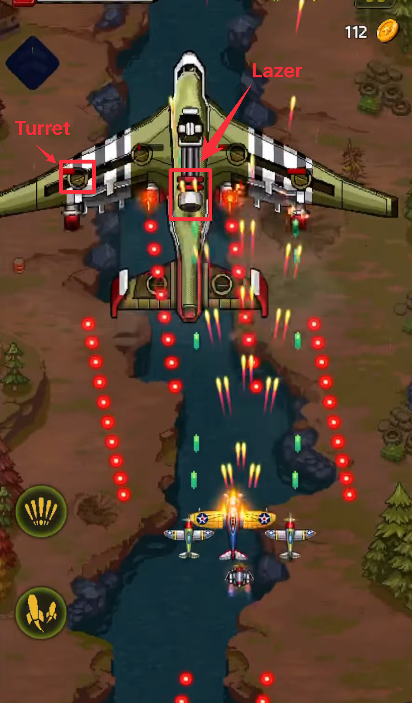

**Phase 1**: Multiple turrets fire red bullets in continuous straight lines. Bullet speed stays constant — player learns rhythm and finds gaps between streams.

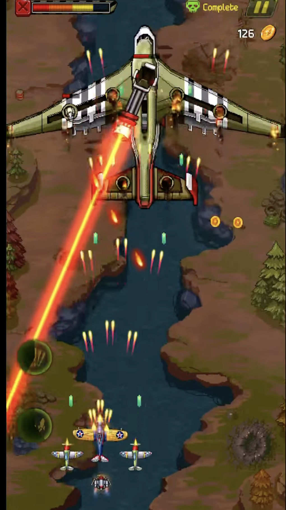

**Phase 2**: Two new threats layer on top. Laser beams sweep diagonally across the screen — telegraphed by red guideline before firing, giving player time to reposition. Side turrets add accelerating bullets (speed increases over distance), forcing player to react faster.

Escalation from Boss 1: constant-speed arc shots → straight-line barrages + accelerating bullets, single phase → multi-phase with lasers. Laser telegraph (red guideline) shows the game still prioritizes readability even as complexity increases.

### Boss 3 — Heavy Tank/Fortress (Level 30)

Most complex boss — 3 phases with progressive layering.

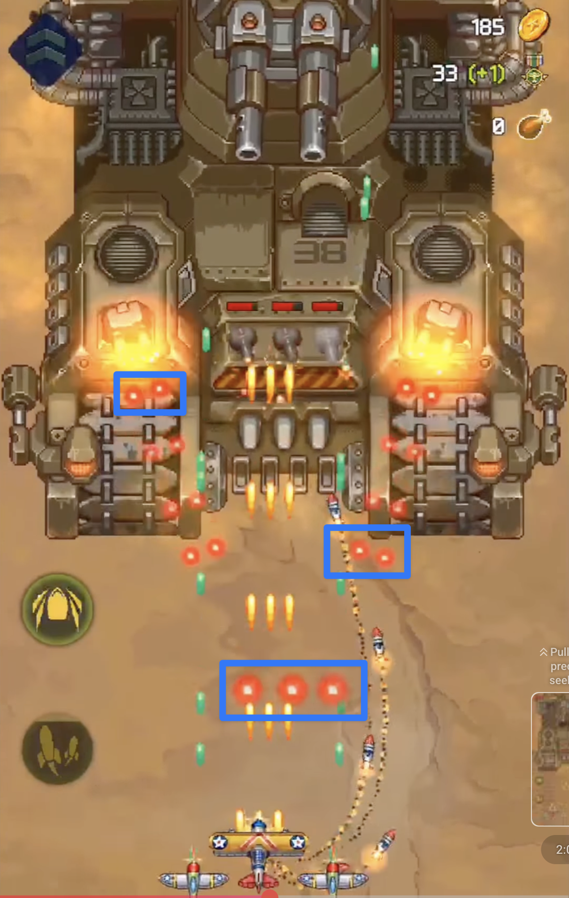

**Phase 1**: Center turret fires 3 red bullets that stop at a fixed distance (zone denial). Two side turrets fire continuous straight-line barrages — player must weave between parallel streams while avoiding stationary center bullets.

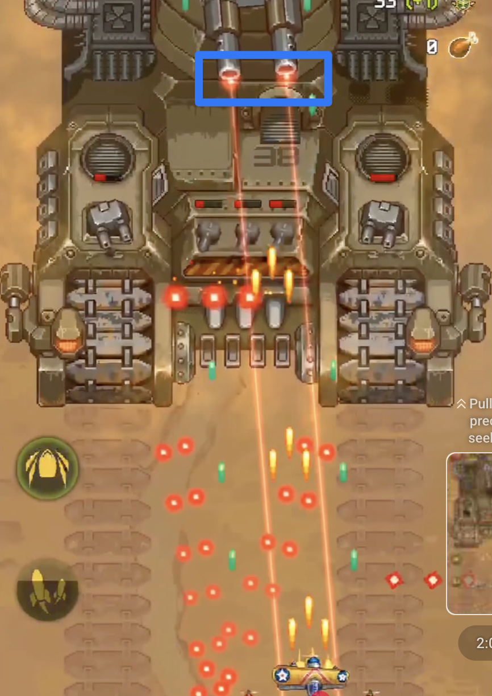

**Phase 2**: After 2 turns, boss deploys 2 homing missiles with laser targeting — lasers track player position, missiles follow. Player now dodges Phase 1 bullets + 2 missiles simultaneously.

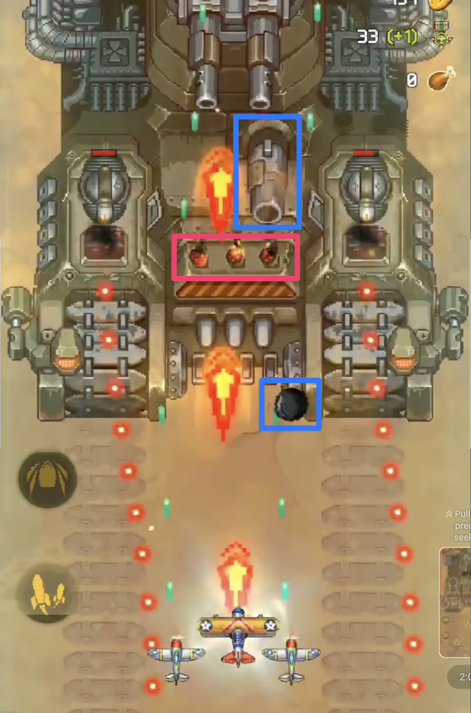

**Phase 3**: After destroying Phase 1 turrets, boss adds a bomb turret — launches a bomb to player position, explodes into a slow rotating cross-shaped bullet pattern. 2 additional sub-turrets deploy continuous single-fire streams.

Escalation across all 3 bosses: Boss 1 (arc + homing, single phase) → Boss 2 (V-wall + lasers, 2 phases) → Boss 3 (zone denial + homing missiles + cross-pattern bombs, 3 phases). Each boss adds a new mechanic layer while keeping previous patterns readable.

## 3.10 Cosmetics

Cosmetics in 1945 Air Force are **not purely visual** — they provide stat bonuses, making them a power source.

### Aircraft Skins

- Each skin grants **+5% ATK and HP** to the aircraft it belongs to.
- **Stackable**: owning 2 skins for the same aircraft = +10%. Ownership alone activates the bonus — player doesn't need to equip the skin.
- Source: mainly Special Events. Most event skins require 40,000–50,000 event items — difficult to obtain F2P without spending.

### Pilot Clothes / Avatar Gear

- Cosmetic items for the pilot avatar (helmets, jackets, goggles) from seasonal events (Halloween, Christmas, Anniversary).
- Grant **economic bonuses**: increased Gold drop rate and Medal/Event Item drop rate per match.
- Key resource accelerator for F2P players — wearing the right gear speeds up currency farming.

### Design Observation

Cosmetics serve dual purpose: visual identity + stat/economy advantage. This blurs the line between vanity and power — owning skins is not optional for competitive players. Event-gated acquisition with high item thresholds creates monetization pressure (see 06_monetization).
