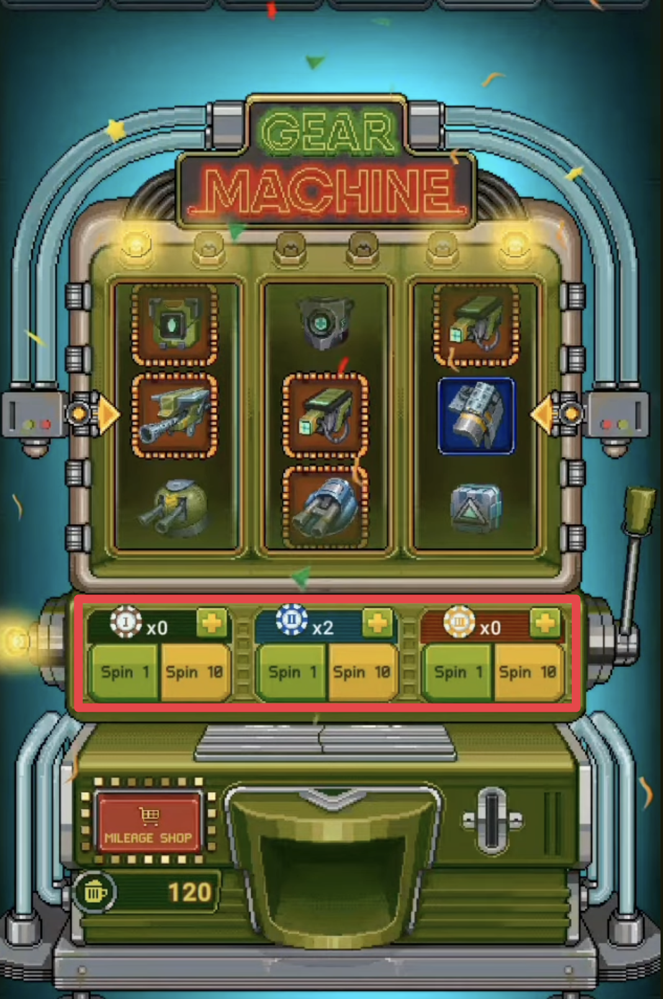
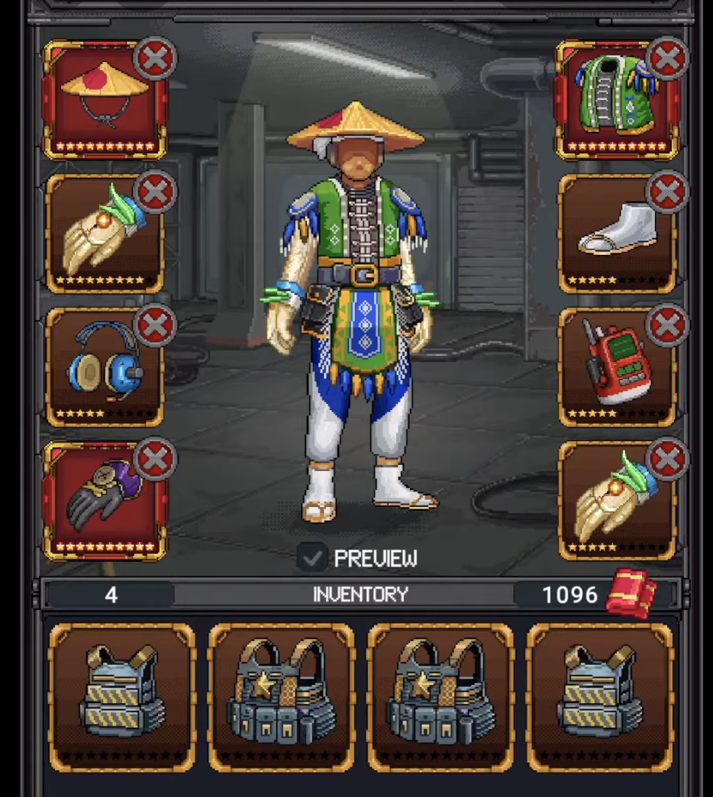
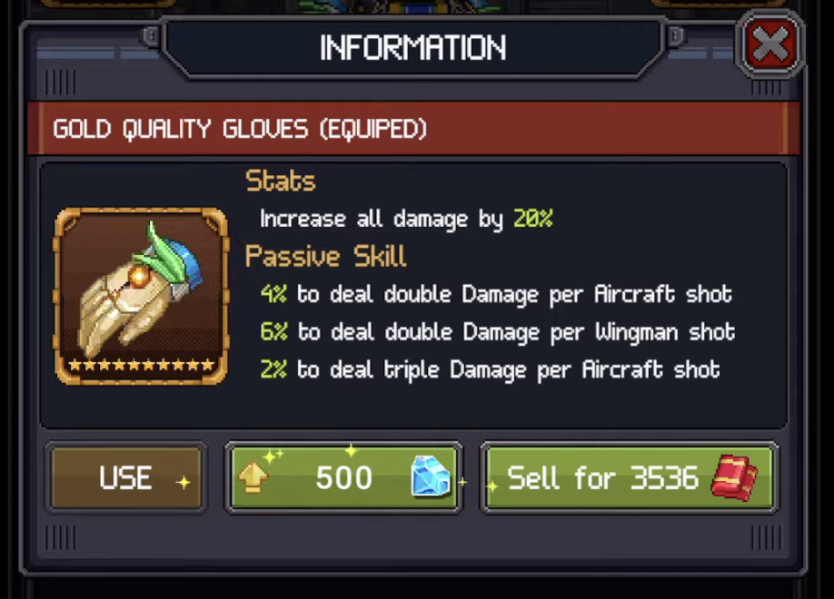

# 4. Progression

## 4.1 Upgrade System

Each unit has two alternating actions that form one upgrade cycle:

### Upgrade → Promote Loop

```text
Upgrade (gold) × N times → Promote (modules) → next star → repeat
```

**Upgrade** spends gold to increase unit stats. Number of upgrades required per star differs by unit type:

| Unit type | Upgrades per star |
|-----------|------------------|
| Aircraft | 10 |
| Wingman | 5 |
| Device | 3 |

Gold cost per upgrade scales with the unit's current star level. Starting cost at star 1 (Tier 1) is similar across unit types — Aircraft 100, Wingman 200, Device 300 — and rises with each star:

| Star | Aircraft | Wingman | Device |
|------|----------|---------|--------|
| 1 | 100 | 200 | 300 |
| 3 | 2,160 | 2,070 | 2,175 |
| 5 | 4,420 | 4,340 | 4,230 |
| 7 | 6,680 | 6,810 | 6,465 |
| 10 | 10,945 | 10,890 | 10,155 |

Within each star, each subsequent upgrade step costs slightly more than the previous (linear increase per step). Cost differences between unit types are small — the main differentiator is how many upgrade steps each unit requires.

**Promote** spends modules to advance to the next star (1 → 2 → ... → 10). Two module types:

- **Unit-specific modules** — e.g., "P-51 Module" only works for P-51
- **Golden Module** — universal, works for any aircraft

Modules are scarcer than gold — sourced from Campaign, Crates, and Events. At star milestones 3, 5, and 7, units unlock extra weapons/abilities.

### Tier Evolution

Units progress through 4 tiers via **merge** — not by promoting the same unit:

```text
Aircraft A (10★ T1) + Aircraft B (10★ T1) → Aircraft C (1★ T2)
Aircraft C (10★ T2) + Aircraft D (10★ T2) → Aircraft E (1★ T3)
... → 1★ T4
```

Merge pairings are **fixed** — each Tier 1 aircraft has one designated merge partner. A Tier 1 aircraft maxes at 10 stars Tier 1; it cannot advance to Tier 2 alone.

**Tier 1** units are sold in variants starting at 1, 3, 6, or 10 stars. **Tier 2, 3, 4** always start at 1 star — cannot be purchased, only merged into.

**Module requirements scale with tier:**

| Tier | Promote cost |
|------|-------------|
| Tier 1 Aircraft A | Module A or Golden Module |
| Tier 2 Aircraft C (merged A+B) | Module A + Module B, or Golden Module |
| Tier 3/4 | Modules from all constituent Tier 1 aircraft, or Golden Module |

Higher tiers need more module types per promote — the merge tree expands the resource requirement. Golden Module bypasses this but is a premium resource.

**Gold cost resets at each tier transition but at a much higher baseline:**

| Tier | First upgrade cost (star 1) | Jump from previous |
|------|----------------------------|-------------------|
| 1 | 100 | — |
| 2 | 12,350 | ×123 |
| 3 | 29,700 | ×2.4 |
| 4 | 229,464 | ×7.7 |

The biggest cost spike is Tier 1 → 2 (123×) and Tier 3 → 4 (7.7×). Each tier transition is a major resource wall that gates long-term progression.

### Custom Gear Upgrade

Gear is a major power source — especially at high levels. Each unit has gear slots (Aircraft 7, Wingman 4, Device 3 — see 03_content for slot details).



**Acquisition**: Gear Machine is a literal slot machine. Player spends Chips (earned from Campaign Tokens or purchased) to spin for random gear. Multiple chip types exist for different gear categories. Failed spins award **Beer** — a pity currency exchangeable in the Mileage Shop for specific gear. Gear Events are the best F2P source for high-quality pieces.

**Upgrade path:**

```text
Gear (1★) → Wrenches to upgrade stars → Gems at promote thresholds → Max 10★
→ Merge (gear + 4 other items) → higher rarity → unlock hidden stat lines
```

- **Wrenches** increase gear star level
- **Gems** required at certain star thresholds to promote further
- Rarity tiers: Bronze → Silver → Gold → Elite. Higher rarity unlocks additional stat lines
- At max 10 stars, merge with 4 other gear pieces to advance rarity


**Stat contribution**: Each gear piece adds percentage-based stats (Damage/Sec, Armor Piercing, Enhanced Accuracy, Critical Rate, Critical Multiplier for offensive; Health, Damage Reduction, Evasion, Block for defensive). A single Gold-rarity gear can add +30% Damage/Sec — gear stacking across all slots makes this the largest power multiplier in the game.

**Set bonus**: Equipping multiple gear pieces of the same damage type activates a set bonus — e.g., 4 Crushing-type guns grant all units (Aircraft, Wingman, Device) additional Crushing Damage. This creates a build optimization layer: players match gear damage type to their aircraft's type for maximum synergy.

**Disassemble**: Selling surplus gear returns **Beer** — used in Mileage Shop or for Elite-tier upgrades. (Pilot Equipment uses a separate disassemble system with Towels.)

### Upgrade Engine

Each unit has engine slots that unlock at star milestones (Aircraft 4 engines, Wingman/Device 2 engines — see 03_content for engine details and cascading bonus structure).


**Resources**: Two materials required per upgrade:

- **Wrenches** — shared with Gear upgrades, creating a resource competition. Sourced from Single Player modes (Bombardment, Protect, Stealth, Assault), Tournament Shops, Weekly Tier Tournaments, and Division Rewards
- **Engine Batteries** — scarcer, event-gated resource. Primarily from Engine Events, Contribution Crates, and Event Shops

**Success chance**: Low-level engine upgrades have 100% success rate. At higher levels, success chance decreases — upgrades can fail and consume resources without progress. This adds an RNG wall on top of the resource wall.

**Priority trade-off**: Wrenches are consumed by both Gear and Engine upgrades. Community consensus is to prioritize Gear first — Gear provides significantly more power per Wrench spent than Engine. Engine becomes a late-game optimization target after Gear is maxed.

### Pilot Gear Upgrade

Pilot Equipment is a separate gear system from aircraft/wingman/device gear. The **Pilot** (main character) wears body gear — helmet, gloves, shoes, backpack, etc.





**Upgrade path:**

```text
Gear (1★) → Towels to upgrade stars → Max 10★ (Gold)
→ Elite 1 → Elite 2 → ... → Elite 5 (max) — requires Gems
```

- **Towels** upgrade star level (1★ → 10★). Towels come from disassembling surplus Pilot Equipment
- After max stars, gear enters **Elite progression** (Elite 1 → Elite 5) which requires **Gems** (premium currency)

**Stat contribution**: Pilot gear provides rare multiplier stats not available from other systems — percentage-based damage boost, double damage chance per shot, and triple damage chance per shot. These scale with gear quality and elite level.

### Certificate

Per-aircraft quest chain. 3 tiers: Basic → Advanced → Master. Each tier has missions (gameplay challenges across multiple modes). Completing all missions grants **permanent base stat boosts** to that aircraft and related units.


Forces player to use specific aircraft across modes — converts breadth of play into permanent power.

### Design Pattern

Multiple upgrade axes prevent the player from feeling "done" after one path flattens. When gold upgrades slow down, promote (modules) becomes the next goal. When promote stalls, tier evolution is the horizon. Each axis uses a different resource, so the player always has something to work toward — but each resource has a different scarcity level, creating natural monetization pressure points.

## 4.2 Player Growth

### Career Rank

Career Rank is account-level progression tied to Campaign completion. Rank uses military tiers (Airman Basic 1/2/3..., etc.) and gates major systems:

| Unlock | Requirement |
|--------|-------------|
| Wingman slot | Campaign Mission 2 (free P47 Thunderbolt) |
| Inventory | Airman 1 |
| Device slot | Campaign Mission 8 |
| PvP (Eliminate) | Airman 2 |
| Sea Battlefield + Battleship | Master Sergeant |
| Clan, advanced modes | Higher ranks |

Early unlocks come fast (Wingman by mission 2, Device by mission 8). Late-game modes like Sea Battlefield require sustained play — rank gates prevent players from accessing content before they understand base systems.

### Unlock Pacing

Unlock pacing controls how fast the player sees the full metagame. Too fast = overwhelm. Too slow = player thinks the game is shallow. 1945 gates unit types and modes behind Career Rank so that each system has time to be learned before the next one appears.

## 4.3 Difficulty Scaling

Each Campaign mission has 3 difficulty tiers (Easy / Medium / Hard). Higher difficulty scales across 4 dimensions:

### Enemy Stats

Enemy HP and damage scale exponentially. On Easy, player can absorb 4-5 hits. On Hard, 1-2 stray bullets or a single laser can kill instantly. Even grunt enemies become tanky — no more one-shot clearing.

### Bullet Density & Speed

Higher difficulty increases bullet count and speed. Screen fills with dense bullet patterns (circular, needle), safe gaps shrink to pixel-level. Enemy aircraft also dive from screen edges at high speed — kamikaze attacks punish players who don't memorize spawn patterns.

### One-Hit Kill Threats

Certain attacks are lethal regardless of stats — homing missiles (telegraphed with warning), sweeping lasers, lightning strikes. These force evasion as the only option — no amount of HP upgrades can tank through them. Difficulty adds more of these threats per wave.

### Boss Escalation

On Hard, bosses gain additional attack types (homing missiles, rotating wide-sweep lasers, screen-wide lightning). More phases with shorter rest windows between transitions. Boss pattern complexity + bullet density create sustained pressure with no breathing room.

### Time Pressure

Higher difficulty tightens time limits for destroying targets. If player DPS is too low, enemies escape or objectives fail — creating a hard gear check. Players who can't clear fast enough lose 3-star rating regardless of survival skill.

### Design Implication

Difficulty scaling serves dual purpose: skill challenge (dodge harder patterns) + power check (need enough DPS to clear in time). This ensures both player skill AND upgrade investment matter — pure skill can't fully compensate for weak gear at high difficulty, pushing players toward upgrade systems.
