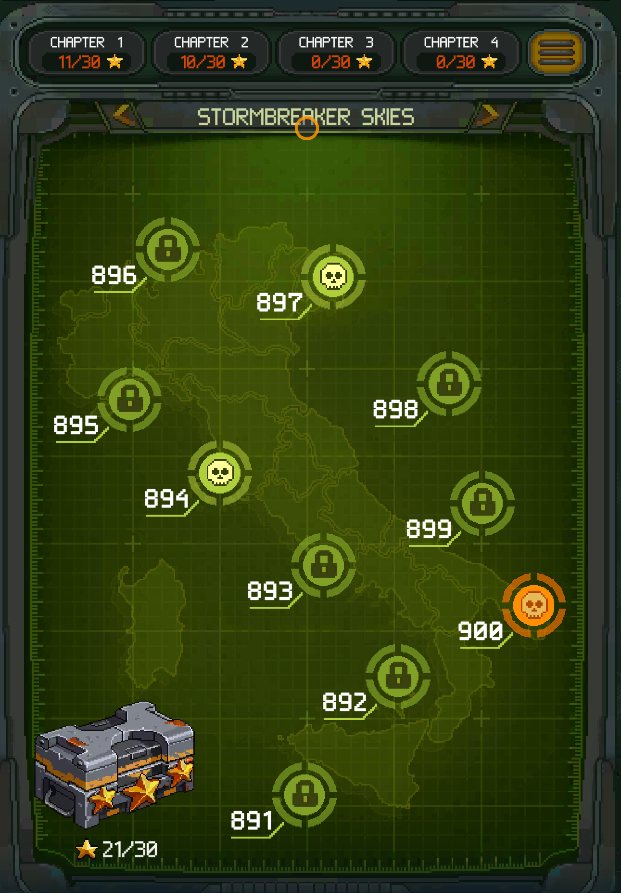

# 5. Economy

## 5.1 Currencies

| Currency | Type | Role |
|----------|------|------|
| Gold | Soft | Primary upgrade currency — spent on unit upgrades (see 04, 4.1) |
| Gems | Hard | Premium currency — tier merge, elite gear, gacha, revives, skips |
| Modules | Material | Unit-specific or Golden (universal). Required for promote (star advance) |
| Wrenches | Material | Gear + Engine upgrades. Shared sink creates resource competition |
| Engine Batteries | Material | Engine upgrades only. Scarce, event-gated |
| Chips | Material | Gear Machine spins (gacha). Multiple types per gear category |
| Beer | Pity / Material | From failed Gear Machine spins + gear disassemble. Spent in Mileage Shop |
| Towels | Material | Pilot gear upgrades. From disassembling surplus Pilot Equipment |
| Medals | Competitive | Earned from PvP/tournaments. Spent in Medal Shop |
| Honor Points | Progression | Earned from Campaign. Used to level up Career Rank (see 04, 4.2) |
| Fuel / Dog Tags | Energy | Gates play attempts per session |

## 5.2 Sources & Sinks

### Sources

| Source | What it gives | Pacing |
|--------|--------------|--------|
| Campaign | Gold, Gems, Honor Points, Modules | Per-run, one-time rewards per difficulty |
| Daily Missions | Mission currency → shop (see below) | Daily cap, resets every 8h |
| Events | Event currency → Skins, Gems, Modules, Aircraft, premium materials | Time-limited, highest value source (FOMO) |
| Quests | Gold, Gems | Ongoing objectives |
| Rewarded Ads | Gold, Gems, continues | Per-view, daily cap |
| Login / Daily Gifts | Gold, Gems, materials | Daily, 4-week cycle |
| PvP / Tournaments | Medals, Wrenches | Weekly cycle |
| Division (Clan) | Contribution Crates (Engine Batteries, materials) | Clan activity |
| IAP | Gems, packs, VIP | Real money |

### Daily Mission Shops

4 daily missions (Bombardment, Protect, Stealth, Assault) share the same structure: complete mission → earn **mission-specific currency** → spend in that mission's shop. Shops offer the same resource pool, just arranged differently.

**Shop tiers** (using Assault Shop as example):

| Tier | Reset | Items available | Cost |
|------|-------|----------------|------|
| Tier 1 | 8h | Crates (3 rarities), Chips (3 types), Modules (Aircraft/Wingman/Device) | 300–7,500 |
| Tier 2 | 8h | Gold, Wrenches, Gems | 2,700 |
| Tier 3 | 80h | Large module bundles (2,000–8,000) | 24,000 |

Daily missions are the primary **targeted farming** source — player chooses which resource to buy rather than receiving random drops. This gives player agency over progression path.

### Events

Events are the **highest-value resource source** in the game. Time-limited events offer rewards unavailable or extremely scarce elsewhere: Skins, Gems, Modules, new Aircraft, Engine Batteries, Chips, and premium materials. Event structure creates FOMO pressure — missing an event means missing exclusive rewards that may not return (see 07_retention_liveops for event rotation details).

### Sinks

| Sink | Consumes | Purpose |
|------|----------|---------|
| Unit upgrade (gold) | Gold | Short-term stat growth |
| Promote (star) | Modules | Star advance, unlock abilities at 3/5/7★ |
| Tier merge | 2× max-star units + Gems | Tier evolution (T1→T2→T3→T4) |
| Gear upgrade | Wrenches + Gems (at thresholds) | Gear star + rarity progression |
| Gear Machine | Chips | Gacha for gear acquisition |
| Engine upgrade | Wrenches + Engine Batteries | Engine stat growth (RNG fail chance) |
| Pilot gear | Towels + Gems (elite tier) | Pilot equipment progression |
| Revive / continue | Gems | Bypass death in-run |
| Extra attempts | Fuel / Gems | More play sessions |
| Clan creation | Gems | Social feature access |

## 5.3 Earn/Spend Pacing

### Campaign Rewards

Each map has 3 difficulty tiers (destroy 70% / 80% / 90% enemies = 1 / 2 / 3 stars). Each tier rewards **once only** — replaying after completion gives no reward. Rewards per map: Gold, Gems, Honor Points, Modules.

**Gold** scales within each chapter (10 maps), then resets lower at next chapter boundary before climbing again (sawtooth curve). Higher difficulty multiplies rewards: Medium ×1.4, Hard ×1.75.

| Map | Easy | Medium (×1.4) | Hard (×1.75) |
|-----|------|---------------|--------------|
| 1 | ~500 | ~700 | ~875 |
| 10 | 1,050 | ~1,470 | ~1,838 |
| 11 | ~800 | ~1,120 | ~1,400 |
| 20 | ~2,300 | ~3,220 | ~4,025 |
| 900 | 105,430 | 140,568 | 175,751 |

**Gems**:

| Map position | Easy | Medium | Hard |
|-------------|------|--------|------|
| Maps x1–x9 | 1 | 2 | 4 |
| Maps x0 (boss) | 4 | 8 | 15 |

**Modules**: Flat within a chapter (all 10 maps give same amount). Type rotates by difficulty: Easy → Aircraft, Medium → Wingman, Hard → Device. Count scales with chapter (~5/map early → ~49/map late).

**Star Chests**: Accumulated stars per chapter unlock milestone chests (X/30 stars). Bonus resource drops tied to total completion.

### Economy Walls

Gold income grows over campaign progression, but upgrade costs grow faster at tier transitions (see 04, 4.1):

| Transition | First upgrade cost | vs. early map gold |
|------------|-------------------|-------------------|
| Tier 1 start | 100 | ~2 runs to afford |
| Tier 2 start | 12,350 | Many runs even at mid-campaign |
| Tier 4 start | 229,464 | Requires late-campaign + Hard farming |

Each tier transition creates a natural bottleneck where gold income no longer keeps pace with upgrade cost — pushing players toward higher difficulty, daily missions, events, or IAP.
