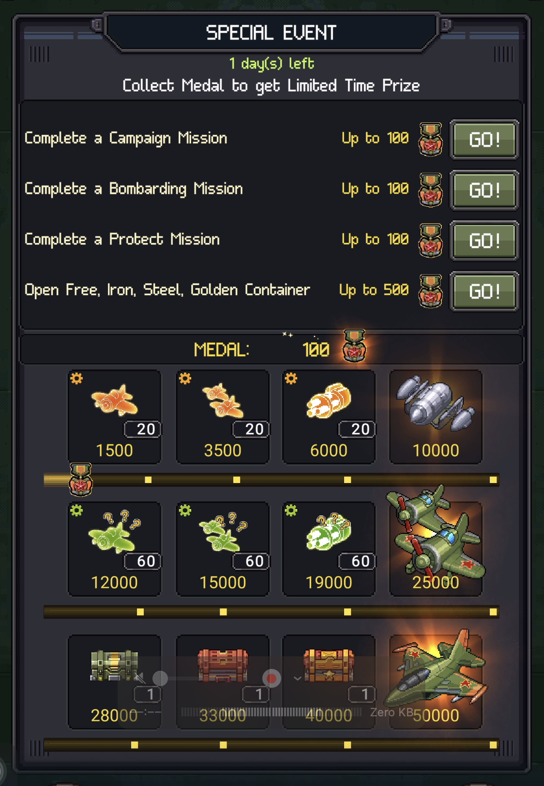
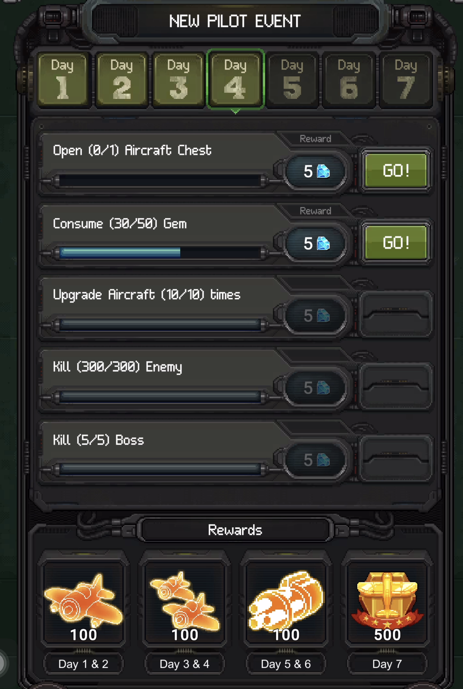

# 7. Retention & LiveOps

## 7.1 Daily & Weekly Hooks

| Hook | Mechanic | Retention role |
|------|----------|----------------|
| Daily Gifts | 7-day cycle (repeats in 4-week rotation). Rewards: gold, modules, materials, aircraft on Day 7. VIP doubles all rewards | Login incentive — miss a day, miss rewards |
| Daily Missions | 4 modes (Bombardment, Protect, Stealth, Assault) with limited daily attempts. Each has own currency → shop (see 05, 5.2) | Resource farming + daily play structure |
| Free Ad Crates | 3 crate tiers × 3 views each, reset periodically. Bonus chest at 80 total views (see 06, 6.1) | Incentivizes daily ad engagement |

Daily hooks create a "checklist" that gives structure to each session. Player knows what to do even without campaign motivation.

## 7.2 Event System

Multiple event types run simultaneously, each with own currency and exchange shop.

| Event type | Duration | Mechanic |
|-----------|----------|----------|
| Seasonal / Holiday | ~2 weeks | Event currency drops in Campaign → exchange shop (crates, modules, skins, gear). Themed: Independence Day, Halloween, Christmas |
| Special Event | 1–3 days | Complete missions → collect medals → milestone rewards (modules → aircraft at top) |
| New Pilot Event | 7 days | Onboarding quest chain guiding new players through core systems with daily milestone rewards |

All events reuse the same combat core with different reward wrappers. Event currency is separate per event — prevents hoarding. Exclusive rewards at top milestones create FOMO.

## 7.3 Clan & Social

Clan (Division) unlocks at Sergeant rank (see 04, 4.2). Details on specific clan mechanics (challenges, co-op rewards, contribution system) need further verification.

| Feature | Role |
|---------|------|
| Division (Clan) | Social group, shared goals, contribution crates |
| United We Stand | Co-op boss fights |
| Squadron Challenges | Clan-exclusive tasks and tournaments |
| Social pressure | Clan membership creates daily obligation — retention via commitment |

## 7.4 Notifications & Re-engagement

Push notifications trigger on: energy full, event start/end, daily reset. In-game prompts show next reward at session end ("Come back tomorrow for Day X gift"). Standard mobile re-engagement patterns.

## 7.5 Long-Term Goals

| Goal type | Retention role |
|-----------|----------------|
| Aircraft collection | 60+ aircraft = long-term collect-them-all drive |
| Full upgrade | Max star/tier on favorite units (10★ T4 = months of play) |
| Campaign completion | 900+ levels × 3 difficulties = massive content depth |
| Career Rank | Account-level prestige, unlocks systems |
| Certificate completion | Per-aircraft quest chains across all modes (see 04, 4.1) |
| Event exclusives | Time-limited aircraft/skins create collection FOMO |

Long-term goals give direction after daily loop stops feeling novel. A player who has "collected 40/60 aircraft" or is "halfway through Certificate on main aircraft" has a reason to keep playing beyond campaign progress alone.
