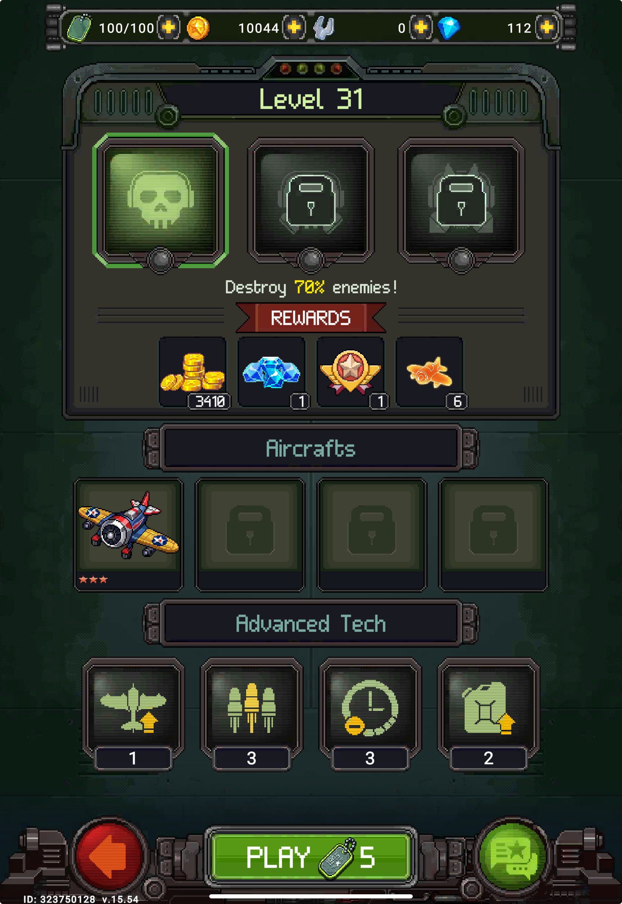

# 8. UX

## 8.1 Dashboard Flow


Dashboard is the central hub — all actions start here.

```text
Dashboard
├── Quick Play (green CTA) → pre-battle → battle      ← primary path, 2 taps to action
├── Mission → Daily Missions (Bombardment, Protect, Stealth, Assault)
├── PvP → competitive modes
├── Squadron grid → tap unit → upgrade/gear/engine
├── Left sidebar → IAP offers
└── Right sidebar → Events, Tournament, Daily Gift
```

**Quick Play** is the largest, most prominent button — game prioritizes getting player into battle as fast as possible. IAP offers are visible but don't block the play flow.

## 8.2 Battle Flow

```text
Dashboard → Quick Play → Pre-battle → Battle → Result → Ad (F2P) → Dashboard
```



**Pre-battle**: Choose difficulty (3 tiers), see reward preview (gold/gems/modules), select aircraft, equip Advanced Tech (power-ups). Play button shows Fuel cost (5 per run) — player knows the resource cost before committing.


**In-battle**: HUD shows HP bar (top), timer, device skill buttons (left). Auto-fire keeps screen clean — player focuses on movement and dodging.

**Post-battle**: Result screen shows rewards earned (gold/gems/modules/stars). F2P players get interstitial ad before returning to dashboard.

## 8.3 In-Match Readability

The largest UI/visual risk is readability under density:

- Player bullets, enemy bullets, explosions, loot, and background all compete for attention.
- Late-game screen density can make death feel unclear.
- Boss size and VFX can reduce safe-space readability. `[VERIFIED-IN-GAME]`

| Element | UX question |
|---------|-------------|
| Enemy bullets | Are they color/shape distinct from player bullets? |
| Player aircraft | Can player track hitbox during effects? |
| Power-ups | Are pickups visible but not confused with bullets? |
| HP/damage state | Does player know when close to death? |
| Boss attacks | Are telegraphs readable before damage happens? |

## 8.4 Game Feel & Feedback

`[NEEDS-DATA]`

Game feel ("juice") analysis — what makes the shooting satisfying:

| Element | What to check |
|---------|---------------|
| Hit feedback | Screen shake, flash, particle on enemy hit? |
| Kill feedback | Explosion size, sound, score popup, loot burst? |
| Player damage | Screen flash, vibration, warning sound? |
| Weapon sound | Does each aircraft/weapon type have distinct audio? |
| BGM | Intensity change during boss? Matches pacing? |
| UI sound | Button presses, upgrade confirm, reward claim? |
| Slow-mo / freeze frame | Any impact pause on boss kill or big explosion? |

Design observation: 1945 relies heavily on visual/audio spectacle to maintain the power fantasy. Without good juice, auto-fire + drag would feel boring. The explosions, bullet density, and screen-filling effects ARE the fun, not just decoration. `[INFERRED]`

## 8.5 Onboarding

Combat onboarding is near-instant — drag to move, auto-fire handles the rest. Player is in action within seconds. The harder onboarding problem is **meta-system complexity**.

### Onboarding Flow

```text
Mission 1–2: Learn movement + auto-fire → unlock Dashboard + Wingman slot (free P47)
Mission 3–7: Campaign progression, first upgrades (gold), first promote (modules)
Mission 8:   Device slot unlocks → third unit type introduced
Airman 1:    Inventory opens → gear/equipment systems visible
Airman 2:    PvP unlocks → competitive layer added
Later:       Clan, Sea Battlefield, Certificate — drip-fed over weeks
```

### Pacing Observation

Game gates systems behind Career Rank milestones (see 04, 4.2) so each system has breathing room before the next appears. Early sessions focus purely on shooting + upgrading aircraft. Wingman at Mission 2 is fast enough to show squad-building early, but Device waits until Mission 8 — enough time to understand upgrade/promote loop on one unit before adding a third.

New Pilot Event (see 07, 7.2) acts as a guided 7-day quest chain that walks new players through: open chests → spend gems → upgrade aircraft → kill enemies → kill bosses. Rewards modules at each milestone — learning and progression happen together.

### Risk

The meta-game has 10+ systems (upgrade, promote, merge, gear, engine, pilot gear, certificate, events, PvP, clan). Even with gated unlocks, the dashboard can feel overwhelming once most systems are open. Late-game dashboard has many buttons, tabs, and notification badges competing for attention.
