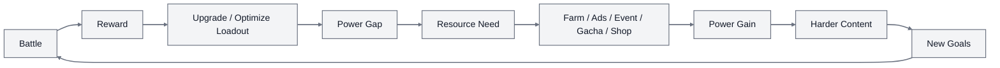
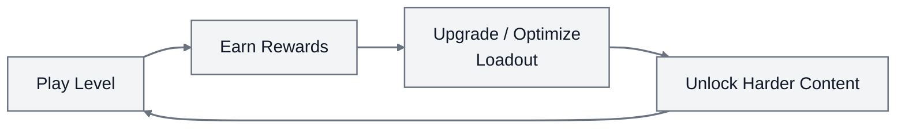
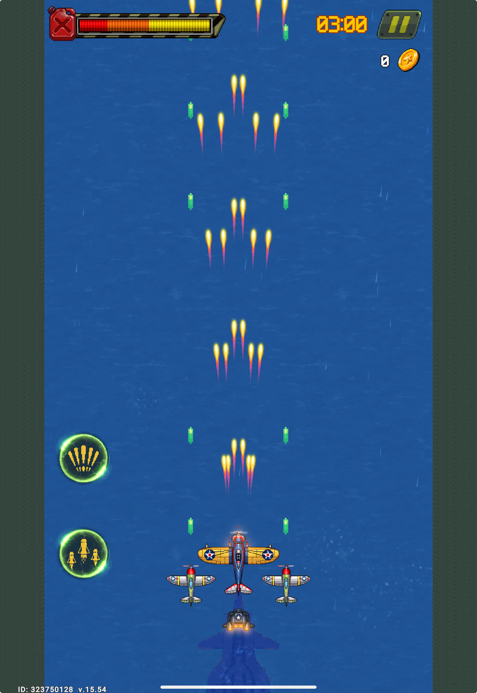
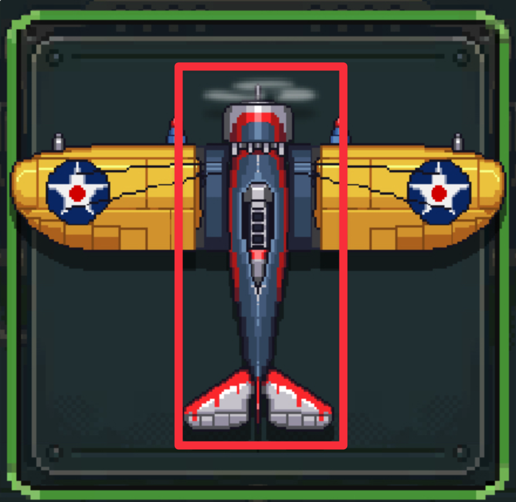
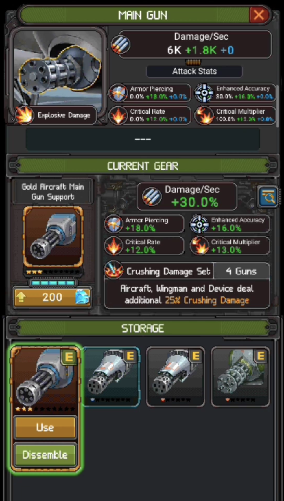
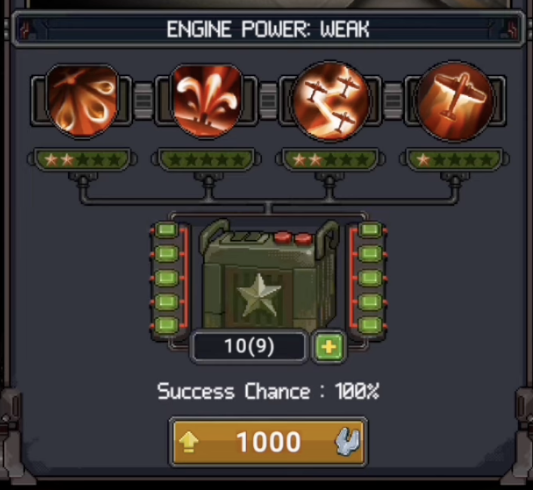
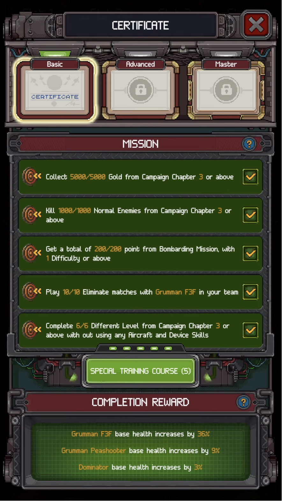
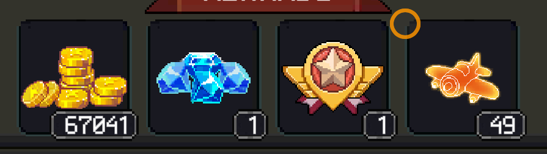
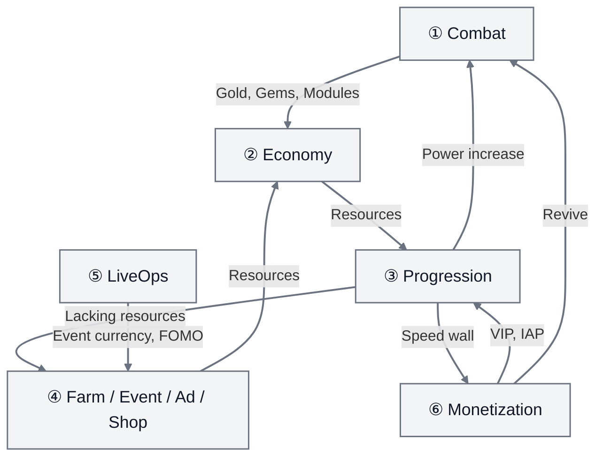

# 1945 Air Force - Design Deconstruction

## 1. Executive Summary

1945 Air Force is a mobile vertical shoot 'em up: players control aircraft via drag/tap, the game auto-fires, and players focus on dodging bullets, clearing waves, defeating bosses, and collecting rewards after each battle.


Main thesis of this deconstruction:

> 1945 Air Force sustains longevity by expanding progression/meta depth — upgrades, collections, gear, events, and economy — while keeping the combat experience arcade-familiar, easy to understand, and easy to return to.

Combat is simple:

- Drag aircraft to dodge.
- Continuous auto-fire.
- Short stages.
- Bullets, explosions, loot, and bosses create strong arcade feel.

But what keeps players is the meta:

- Many units to own and invest in: Aircraft, Wingman, Device, Co-pilot, Pilot.
- Multiple power axes: upgrade, promote, tier merge, gear, engine, certificate.
- Many currencies: Gold, Gems, Modules, Wrenches, Chips, Beer, Towels, Fuel, event currency.
- Many return routines: daily gift, daily mission, event, PvP, clan, collection.
- Many monetization touchpoints: rewarded ads, interstitial ads, revive, IAP pack, VIP, battle pass, gacha, limited offer.

This deconstruction analyzes how 1945 Air Force organizes systems like aircraft, gear, events, VIP, economy, and monetization into a continuous loop: players enter combat, earn rewards, use rewards to upgrade, encounter new resource needs, then get routed to farming, events, ads, gacha, or shop before returning to combat stronger.



The sections below analyze each layer of this loop.

## 2. Core Operating Model

1945 Air Force operates on this core loop:



For players, this loop is fast: open game, tap into a level, drag aircraft to dodge bullets, watch auto-fire, finish the battle, collect rewards. A session can last just a few minutes but still feels like progress, since players usually gain resources to upgrade or move closer to the next goal.

The game doesn't require learning much before the fun starts. Only one action matters: move the aircraft to survive. Auto-fire handles offense, so difficulty focuses on reading bullets, finding safe gaps, and dodging at the right moment.

At the meta level, the loop goes deeper:

```text
Combat Result
-> Gold / Gems / Modules / Materials
-> Aircraft / Wingman / Device / Gear / Engine upgrade
-> Power increase
-> Harder missions / higher difficulty / tougher bosses
-> New resource requirements
```

Rewards always tie to a next investment need. If players have Gold, they can upgrade. If they lack Modules, they must go to campaign, events, or shop. If they lack Wrenches, they must farm dailies, tournaments, or events. If they want better gear, they get pulled into Gear Machine/gacha.

Each level = one small step: more resources, more power, closer to harder content.

The operating model has 4 layers:

| Layer                 | Role                                                          |
| --------------------- | ------------------------------------------------------------- |
| Core combat           | Creates instant fun and reward source                         |
| Meta progression      | Creates short, mid, and long-term goals                       |
| Economy routing       | Determines what players must do when lacking resources        |
| LiveOps / monetization| Turns progression needs into return habits and spending triggers|

Combat creates rewards, rewards create upgrade needs, upgrade needs keep players coming back and open spending opportunities. The entire game revolves around this loop.

## 3. Systems Breakdown

### 3.1 Core Combat System

Core combat in 1945 Air Force has 5 main components:

- One-thumb movement: players drag or tap to move the aircraft.
- Auto-fire: the game shoots automatically, players don't need to hold a fire button.
- Active skills: aircraft skill and device skill, activated mid-battle. Skill type depends on the equipped loadout.
- Bullet dodge: the main challenge is reading bullets, dodging, and understanding the hitbox.
- Wave/boss structure: levels consist of enemy waves, power-ups, and bosses with patterns.



Auto-fire reduces execution burden on mobile. On a small touchscreen, having to shoot and dodge simultaneously makes controls heavy. 1945 Air Force removes the fire button so players focus on positioning.

Skill expression comes from dodge and timing: hitbox is smaller than the sprite, bullet patterns get denser, bosses have phases and telegraphs.



Core combat serves as the reward engine. Every time a player plays a level, the game has opportunities to:

- Deliver rewards.
- Trigger ads/revive.
- Push players toward upgrades.
- Create a "just a bit more and I'll clear it" feeling, driving the need to power up.

Combat's risk is readability. When bullets, player shots, explosions, loot, and background stack on top of each other, players can die without understanding why. For shmups, this is dangerous: difficult is acceptable, but unreadable feels unfair.

### 3.2 Loadout / Content System

1945 Air Force has multiple object types for players to own and build:

- Aircraft: main unit the player controls.
- Wingman: support fire, expands damage footprint.
- Device: utility/burst support in battle.
- Co-pilot: support character with stats and skills.
- Pilot: main character with dedicated gear.


Each unit type is an **investment surface** — another place for players to sink resources.

Aircraft has multiple investment layers:

- Star/upgrade.
- Gear slot.
- Engine.
- Certificate.
- Skin with stat bonus.


Wingman and Device also have their own gear/engine. Pilot has separate body gear and stat multipliers. The result: players nearly always have something to upgrade, optimize, replace, merge, or farm.


Role of the Loadout System:

| Role                 | Effect                                                  |
| -------------------- | ------------------------------------------------------- |
| Collection           | Creates ownership goals across aircraft, wingman, device |
| Build depth          | Players must choose units, damage types, gear, synergies|
| Resource sink        | Each unit opens more places to spend Gold, Modules, Wrenches, Gems |
| Long-term retention  | Players rarely feel "done"                              |
| Monetization surface | Packs, gacha, event rewards, VIP advantages have room to sell |

Core combat doesn't need much change but the game still deepens over time through the loadout system. Risk: complexity scales fast — opening too many systems early turns the dashboard into a maze.

### 3.3 Progression System

Progression in 1945 Air Force doesn't sit on a single axis. The game splits power growth into multiple layers:

- Upgrade with Gold.
- Promote with Modules.
- Tier Merge with max-star units + Gems.
- Gear upgrade with Wrenches/Gems and rarity merge.
- Engine upgrade with Wrenches + Engine Batteries.
- Pilot gear with Towels/Gems.
- Certificate through dedicated mission chains.



If there were only one upgrade path, players would hit the ceiling fast. Multiple paths ensure that when one slows down, others remain open.

Example:

```text
Out of Gold -> farm Campaign/Daily
Lacking Modules -> Campaign/Event/Shop
Lacking Gear -> Gear Machine or Event
Lacking Wrenches -> Daily/Tournament/Event
Need new Tier -> need 2 max-star units + Gems
Need advanced stats -> Gear/Engine/Certificate
```

The game constantly creates next goals:

- Short-term: gain 1 level, earn 1 star, clear the next level.
- Mid-term: unlock gear slot, promote unit, complete daily shop.
- Long-term: merge to higher tier, max gear rarity, complete certificate, collect units/skins.

Strength: players always have something to do.

Weakness: if resource costs scale too fast, progression walls are perceived as paywalls. Players stop feeling they need to play better and start feeling forced to farm or pay.





### 3.4 Economy System

1945 Air Force's economy consists of many currencies and materials:

- Gold: soft currency for upgrades.
- Gems: hard currency for revive, merge, elite gear, gacha, skip, shop.
- Modules: unit promotion.
- Wrenches: gear/engine upgrade.
- Engine Batteries: engine upgrade, scarce/event-gated.
- Chips: Gear Machine/gacha.
- Beer: pity/material from failed spins or disassembly.
- Towels: pilot gear upgrade.
- Medals: PvP/tournament shop.
- Fuel/Dog Tags: gate attempts/sessions.
- Event currency: used in event shop, expires after event.

The economy **routes behavior**: when lacking a resource, the game directs players toward different activities.

Example:

```text
Lacking Gold -> replay/farm Campaign, Daily, ad crate
Lacking Modules -> Campaign difficulty, Event, Module shop
Lacking Wrenches -> Daily Mission, Tournament, Event
Lacking Gear -> Gear Machine, Chips, Beer shop
Lacking Gems -> campaign reward, ad, IAP
Lacking Event item -> play event/campaign during event period
```

Battle creates resources → resources feed into progression → resource shortage → game opens daily/event/shop/ad/gacha → return or spend.



Each resource has a distinct role, so the game regulates progression effectively. Risk: cognitive load — new players struggle to distinguish Chips, Beer, Wrenches, Batteries, Modules and don't know what to farm first.

### 3.5 Retention / LiveOps System

#### Session flow

A typical session: open app → check daily hooks → choose mode → play 1-3 battles → claim rewards → upgrade if enough resources → continue or exit. Sessions are short (a few minutes) but have closure after each battle.

#### Daily / Weekly hooks

| Hook           | Mechanism                                                                                            | Role                      |
| -------------- | ---------------------------------------------------------------------------------------------------- | ------------------------- |
| Daily Gift     | 7-day cycle, repeats 4 weeks. VIP doubles rewards. Day 7 gives aircraft                              | Login incentive           |
| Daily Missions | 4 modes (Bombardment, Protect, Stealth, Assault), limited attempts. Each mode has its own currency → shop | Selective resource farming |
| Free Ad Crates | 3 tiers × 3 attempts, periodic reset. Bonus chest at 80 ad views                                     | Daily ad engagement       |


#### Game modes and retention role

| Mode                     | Role                                          |
| ------------------------ | --------------------------------------------- |
| Campaign                 | Main progression, 900+ levels × 3 difficulties|
| Daily Missions           | Targeted resource farming                     |
| Boss Fights              | Skill check, damage test                      |
| PvP (Eliminate)          | Competitive tension                           |
| Last Stand               | Survival/endurance                            |
| Co-op (United We Stand)  | Social                                        |
| Clan/Squadron Challenges | Clan retention, exclusive rewards             |
| Events                   | FOMO, exclusive rewards                       |

All modes share the same combat core, only changing objectives and reward wrappers.

#### Event system

| Event type       | Duration | Mechanism                                                                         |
| ---------------- | -------- | --------------------------------------------------------------------------------- |
| Seasonal/Holiday | ~2 weeks | Event currency drops in Campaign → exchange shop (crates, modules, skins, gear)   |
| Special Event    | 1-3 days | Complete missions → collect medals → milestone rewards                            |
| New Pilot Event  | 7 days   | Onboarding quest chain for new players, milestone rewards                         |


Event currency is unique per event and cannot be stockpiled → players must play during the event period. Exclusive rewards at high milestones create FOMO.

#### Unlock pacing

The game gates systems behind Career Rank to avoid overwhelming new players:

| Unlock          | Requirement                   |
| --------------- | ----------------------------- |
| Wingman slot    | Campaign Mission 2 (free P47) |
| Device slot     | Campaign Mission 8            |
| PvP (Eliminate) | Airman 2                      |
| Sea Battlefield | Master Sergeant               |
| Clan            | Higher ranks                  |

Fun comes first, complexity opens later. Wingman unlocks early (mission 2) to show squad-building, but Device waits until mission 8 — enough time to understand upgrade/promote on one unit before adding a third.

#### 3-tier retention

| Tier       | Mechanism                           | Example                                                                          |
| ---------- | ----------------------------------- | -------------------------------------------------------------------------------- |
| Short-term | Short battles, clear rewards, near upgrades | Simple controls, short stages, constant shooting/explosions/loot              |
| Mid-term   | Power gate + daily routine          | Harder campaign, daily missions for targeted resources, gear/engine farming      |
| Long-term  | Hard-to-complete goals              | 60+ aircraft, tier merge T2/T3/T4, certificate, event-exclusive skins, clan/PvP |

1945 Air Force runs an infinite treadmill: when one progression axis nears max, another remains — aircraft → wingman → device → gear → engine → pilot gear → certificate → skin/event.

#### Re-engagement

Push notifications when energy is full, event start/end, daily reset. Session end shows the next reward to pull players back.

#### Risks

- Dashboard clutter: too many events, badges, offers, shops, missions → new players overwhelmed.
- Bloated metagame: if players can't identify the next best action, retention hooks become confusion.

### 3.6 Monetization System

1945 Air Force uses hybrid monetization:

#### Ad system

| Ad type        | When                                                                      | Choice                   | Purpose                         |
| -------------- | ------------------------------------------------------------------------- | ------------------------ | ------------------------------- |
| Rewarded video | After battle (double reward), after death (revive), daily free gems, free crates | Opt-in                   | Converts desire state into ad view |
| Interstitial   | After completing a Campaign map                                           | Forced, skip after delay | Baseline ad revenue             |

Buying any IAP (even \$0.99) reduces or removes interstitials → the first purchase is both a QoL upgrade and a power boost.

Revive: dying mid-battle → 2 options: Gems or watch ad (max 5 ads/day). High conversion because players already invested time in that run.


Free tab in shop: 3 crate tiers × 3 attempts per tier. Rewards: Gold (up to 3,000), Gems/Wrenches/Modules (up to 15). Bonus chest at 80 total ad views.

#### IAP

| IAP type                 | Target        | Price             |
| ------------------------ | ------------- | ----------------- |
| Battle Pass Premium      | Active player | \$14.98           |
| Battle Pass Premium Plus | Active player | \$19.98           |
| Battle Pass Ultra        | Heavy spender | \$39.98           |
| Battle Pass Ultra Plus   | Heavy spender | \$49.98           |
| Gem Packs                | Any           | \$0.98 – \$149.98 |
| Limited Offers           | Active player | Varies (FOMO)     |

#### Popup offers

Star upgrade (e.g., 3 star → 10 star with Gems), aircraft promotion purchase, cheap upgrades for new accounts. Appear when opening the game, after each battle, when entering menus — repeated constantly.

#### Gacha / Gear Machine

Gear Machine ties gacha to power rather than cosmetics alone. Chips fuel pulls, gear provides stats, Beer serves as pity so failed pulls still have value. Even without winning, players accumulate Beer to exchange for gear in the Mileage Shop.

#### VIP

Cumulative lifetime spending — not a subscription. Each $1 ≈ 10 VIP Points. VIP level is permanent, never resets. Scales to VIP 50 (5,000,000+ points).

Privileges stack: permanent damage + fuel increase, bonus daily gold, extra daily mission attempts, shop resets, equipment backup slots.


#### Monetization triggers by desire state

| Player state            | Trigger                                  |
| ----------------------- | ---------------------------------------- |
| Died mid-battle         | Revive via ad or Gems                    |
| Lacking resources       | Pack, ad crate, daily grind              |
| Wants better gear       | Gear Machine/gacha                       |
| Wants faster progress   | VIP, battle pass, IAP                    |
| Afraid of missing event rewards | Limited offer/event pack          |
| Annoyed by popup ads    | First purchase to reduce/remove interstitials |
| Just finished a battle / opened game | Popup offer star upgrade, promotion pack |

#### Progression speed by spending tier

| Tier          | Impact                                                                                                                                      |
| ------------- | ------------------------------------------------------------------------------------------------------------------------------------------- |
| F2P           | Daily cap, ad-gated rewards, no stat bonus. Slowest                                                                                         |
| Light spender | Remove interstitials + Battle Pass + low VIP                                                                                                |
| Heavy spender | VIP stat bonus + extra daily attempts + premium resources. Advantage compounds: higher stats → clear harder content → better rewards → faster upgrades |

The game sells speed, convenience, attempts, and advantage — it doesn't lock content behind paywalls.

#### Risks

- Compound spending advantage too strong → PvP/leaderboard perceived as pay-to-win.
- Popup offers appear too frequently → players who don't want to buy are still forced to see them constantly, causing frustration.

## 4. System Connection Map

The systems in section 3 interact with each other: which system triggers which, and where players are directed at each point.



### 4.1 Combat → Economy

Each time a level is played, the game pays specific resources:

| Mode           | Resource output                                                                                            |
| -------------- | ---------------------------------------------------------------------------------------------------------- |
| Campaign       | Gold, Gems, Honor Points, Modules (type by difficulty: Easy → Aircraft, Medium → Wingman, Hard → Device)   |
| Daily Missions | Mode-specific currency → exchange in that mode's shop (Wrenches, Modules, Chips, Gold, Gems)               |
| Events         | Event-specific currency → exchange shop (skins, aircraft, Modules, Gems, gear)                             |
| PvP/Tournament | Medals → Medal Shop (Wrenches, materials)                                                                  |
| Clan           | Contribution Crates (Engine Batteries, materials)                                                          |

Higher difficulty pays more: Medium ×1.4, Hard ×1.75 compared to Easy. Boss maps at the end of each chapter pay 4× the Gems of regular maps.

### 4.2 Economy → Progression

Each resource pushes players into a different upgrade path:

| Resource         | Feeds into                                                     |
| ---------------- | -------------------------------------------------------------- |
| Gold             | Upgrade unit (ATK/HP)                                          |
| Modules          | Promote (star up)                                              |
| Wrenches         | Gear upgrade + Engine upgrade (competing for same resource)    |
| Engine Batteries | Engine upgrade (scarce, event-gated)                           |
| Chips            | Gear Machine / gacha                                           |
| Towels           | Pilot gear upgrade                                             |
| Gems             | Tier merge, elite gear, gacha, revive                          |
| Beer             | Mileage Shop (pity from failed gacha spins or gear disassembly)|

Key point: Wrenches split between Gear and Engine. Gear gives more power per Wrench so it's usually prioritized first. Engine is a late-game target after Gear is maxed.

### 4.3 Progression → Combat + Routing

Power increases → clear higher difficulty → higher reward per run → faster upgrades → clear even harder content. This loop self-accelerates until hitting an upgrade wall.

Upgrade cost spikes at each tier transition:

| Transition | First upgrade cost | vs. Tier 1    |
| ---------- | ------------------ | ------------- |
| Tier 1     | 100 Gold           | —             |
| Tier 2     | 12,350 Gold        | ×123          |
| Tier 3     | 29,700 Gold        | ×297          |
| Tier 4     | 229,464 Gold       | ×2,295        |

When Gold income from Campaign can't keep up with costs, players are pushed toward:

- Farm Daily Missions (targeted resources via shop).
- Play Events (highest-value source, exclusive rewards).
- Watch rewarded ads (Gold, Gems, materials).
- Buy IAP/VIP (acceleration).

### 4.4 LiveOps → Routing

Events create their own currency that can't be stockpiled across events → players must play during the event period. Exclusive rewards (skins, aircraft) at high milestones create FOMO. Daily hooks (Daily Gift 7-day cycle, Daily Missions reset every 8h, Free Ad Crates) create a daily checklist.

### 4.5 Monetization → Progression (compound advantage)

| Spending tier | Impact                                                                                                                                              |
| ------------- | --------------------------------------------------------------------------------------------------------------------------------------------------- |
| F2P           | Daily cap, ad-gated rewards, no stat bonus                                                                                                          |
| Light spender | Remove interstitial ads + Battle Pass + low VIP                                                                                                     |
| Heavy spender | VIP stat bonus + extra daily attempts + premium resources. Each advantage compounds: higher stats → clear harder content → better rewards → faster upgrades |

VIP is a spending ladder (lifetime, no reset). Each $1 ≈ 10 VIP Points. High VIP grants extra damage, fuel, daily attempts, shop resets — all compound on each other.

## 5. Level Design

1945 Air Force has 900+ campaign levels × 3 difficulties = 2700+ variations. Handcrafting each level isn't feasible — the game uses a template + scaling system.

### 5.1 Enemy Pool

The game builds an enemy pool categorized by role:

| Role    | Function in level                                                 |
| ------- | ----------------------------------------------------------------- |
| Grunt   | Low HP, fills the screen, gives players kill rhythm + loot        |
| Elite   | Higher HP or denser bullets, forces target prioritization         |
| Special | Changes the rules: homing, shield, kamikaze, heavy bullet patterns|
| Boss    | Pattern-learning, level climax, DPS check                         |

Each level is a combination from this pool — varying count, type, and spawn order to create new levels without designing from scratch.

### 5.2 Wave Composition

Each level follows a fixed wave structure:

```text
Opening wave → low pressure, warm-up, mostly grunts
Mid waves    → density increases, mix of grunt + elite + special, power-ups appear
Pre-boss     → highest pressure, few breaks, many special enemies
Boss         → large target, repeating patterns, mastery check
```

Pacing alternates tension and relief — if every wave is dense, players burn out; if every wave is light, they get bored. 1945 Air Force uses pressure bursts → short breathing room → next burst.

### 5.3 DPS Threshold

Each level has total enemy HP + time limit → creating a **DPS threshold** (minimum damage/second needed to clear).

Mechanism:

- Level designer sets: enemy HP, count, time limit
- Progression designer sets: power curve (ATK from upgrades, gear, engine, tier)
- Gap between DPS threshold and player power = **progression wall**

Player power < DPS threshold → can't clear in time → fail → need to upgrade. The power systems (ATK, gear damage%, engine bonus) exist to serve this measurement.

Time limits on higher difficulties are tighter: if DPS isn't sufficient, enemies escape or objectives fail → lose 3-star even with great dodging.

### 5.4 Difficulty ×3

Each level has 3 difficulty tiers (Easy / Medium / Hard), scaling across 5 dimensions:

| Dimension            | Easy                       | Hard                             |
| -------------------- | -------------------------- | -------------------------------- |
| Enemy HP/damage      | Can take 4-5 hits          | 1-2 hits kills                   |
| Bullet density/speed | Wide gaps, easy dodging    | Pixel-level gaps, dense bullets  |
| One-hit kill threats  | Few                        | Many (homing, laser, lightning)  |
| Boss complexity      | Few phases, simple patterns| Added attack types, shorter phases|
| Time pressure        | Relaxed                    | Tight DPS check                  |

Difficulty scales both skill (harder patterns to dodge) and power (need sufficient DPS). On Hard, great skill can't compensate for weak gear → forced to upgrade.

### 5.5 Boss Design

Bosses are the level climax. Players must read patterns, find gaps, and dodge under constant pressure.

**Boss 1 — Battleship (early campaign)**


Large warship occupying the upper half of the screen. Fixed turrets → players learn bullet sources. 2 attack types: arc/spread bullets from turrets + homing missiles. Turrets can be destroyed individually → reducing bullet density as the fight progresses.

Simple, readable patterns. Players learn to read bullet sources and prioritize positioning from this boss.

**Boss 2 — Large Bomber (Level 20)**


Phase 1: multiple turrets firing continuous straight-line bullets. Fixed bullet speed → learn rhythm, find gaps.


Phase 2: adds laser sweep (red telegraph before firing) + accelerating bullets from side turrets. Escalation from Boss 1: adds phases, adds threat types, but keeps telegraphs readable.

**Boss 3 — Heavy Tank/Fortress (Level 30)**


Phase 1: center turret fires 3 bullets that stop in place (zone denial) + 2 side turrets fire straight-line. Must dodge parallel streams + avoid the blocked zone in the center.


Phase 2: adds 2 homing missiles with laser tracking. Dodge Phase 1 bullets + 2 missiles simultaneously.


Phase 3: bomb turret fires at player position → explodes into slowly rotating cross-pattern + 2 auxiliary turrets firing single shots.

**Escalation pattern across 3 bosses:**

|              | Boss 1       | Boss 2                      | Boss 3                            |
| ------------ | ------------ | --------------------------- | --------------------------------- |
| Phases       | 1            | 2                           | 3                                 |
| Bullet types | Arc + homing | Straight + laser + accel    | Zone denial + homing + bomb cross |
| New mechanic | —            | Phase transition, telegraph | Zone denial, layered threats      |

Each boss adds 1 new mechanic layer while keeping old mechanics readable. Complexity increases but players still understand why they died.

### 5.6 Scaling to 900+ Levels

Core mechanisms for creating 900+ levels from a template system:

1. **Enemy pool** → mix different roles per level
2. **Stat scaling** → same enemy types, HP/damage increase with level number
3. **Boss rotation** → boss pool is reused, stats scaled, phases added at higher levels
4. **×3 difficulty** → 1 level × 3 tiers = 3 variations
5. **Mechanic drip** → new enemy types appear gradually through campaign (homing → shield → laser → kamikaze...)
6. **Power gate** → DPS threshold increases → forces upgrades → ties to progression system

The game designs a **level creation toolkit** (enemy pool, wave rules, scaling formulas, boss pattern library) — not handcrafting each level. Low production cost, high output.

Note: analysis above is based on observation from 30+ early levels and collected evidence. Exact mechanisms (scaling formulas, procedural vs. manual config) require source access or deeper play to verify.

## 6. Game Flow / Player Journey

This section follows the actual player journey through screens — from dashboard into battle, from battle to upgrades, from upgrades to resource hunting.

### 6.1 Battle Flow


Dashboard is the central hub. Quick Play is the most prominent button — directing players into battle.


Pre-battle: choose difficulty, preview rewards, select aircraft. Fuel cost displays before pressing Play.


In-battle: HP bar at top, timer, device skill buttons. Auto-fire keeps the screen clean — players focus on dodging.


Result: displays rewards earned (Gold, Gems, Modules, stars).


Right after the result, a Rank Up Offer popup appears — offering star upgrade with Gems. Monetization trigger attached to the moment players finish a battle and want faster progress.

Return to Dashboard. A full battle session from pressing Quick Play to returning takes a few minutes.

### 6.2 Progression Flow


From Dashboard, tap the squadron grid.


Select aircraft from the list.


Aircraft detail: view stats, star level, gear slots, engine.


Gear screen: 7 slots (4 offensive on top, 3 defensive below). Empty slots → need gear.


No gear → enter Gear Machine (gacha). Use Chips to spin, receive gear or Beer (pity).


Received gear from spin.


Equip gear on aircraft.


Upgrade gear with Wrenches.


Gear equipped and upgraded — power increased, return to combat stronger.

### 6.3 Resource Routing Flow

When lacking resources to upgrade, the game directs players to sources:


From Dashboard, enter Mission.


Select Campaign mission to farm.


Check Daily Mission Shop — buy Wrenches with mission currency. Targeted farming: players choose which resource to buy.


Got Wrenches → return to upgrade gear.


Or play the mission directly to earn more.


Besides Daily Mission, Events are also a source — open Event from Dashboard.


Event Exchange Shop: trade event currency for modules, gear, skins.

### 6.4 Monetization Flow


Death mid-battle → Emergency Repair: watch ad (No Ads left = out of attempts) or pay 10 Gems.


Dashboard always shows IAP offers on the left: Starter Pack, Premium Pack, Supply Pack, Equipment, Growth Bundle. Popup offers also appear when opening the game or finishing a battle.


IAP pack detail.

### 6.5 Pilot Equipment


Pilot has a separate gear system — body equipment (helmet, gloves, shoes, backpack...).


Pilot gear comes from Lucky Wheel — gacha wheel, spin x1 or x10. Requires Tickets to spin.


Tickets cost Gems: 125 Gems/ticket, or 1000 Gems for 10 tickets (20% discount).


Pilot gear provides multiplier stats (double/triple damage chance) not available in other systems. Upgraded with Towels + Gems.

### Notes

- Strength: Quick Play → battle in 2 taps. Short sessions with clear closure (result screen + reward).
- Weakness: late-game dashboard has too many buttons, badges, offers, and system entry points. Popup offers appear constantly, causing clutter.
- Not covered: PvP, Clan, Sea Battlefield/Battleship — late-game flows that require higher rank to unlock.

## 7. Strengths & Weaknesses

### Strengths

**1. Simple input, strong accessibility**

Auto-fire and one-thumb movement make the game easy to pick up. New players understand combat in seconds, but skill expression remains through dodge, hitbox, and boss patterns.

**2. Combat core reused effectively**

Campaign, daily, event, boss, PvP/competitive can all use the same combat foundation. The game doesn't need new gameplay for each mode, only different objectives and reward wrappers.

**3. Many investment surfaces**

Aircraft, Wingman, Device, Pilot, Gear, Engine, Certificate create many places to spend resources. Rewards from battle always have somewhere to go.

**4. Multi-layered retention**

The game has short-term rewards, mid-term daily/progression, long-term collection/tier/event. Multiple layers give players reasons to return at different engagement levels.

**5. Monetization tied to desire state**

Revive, resource shortage, event FOMO, VIP speed-up, ad removal all connect to clear player needs.

### Weaknesses / Risks

**1. Complexity overload**

Too many units, gear, engines, currencies, events, and shops can overwhelm new players.

**2. Combat readability**

Bullets, explosions, pickups, player shots, and boss VFX can obscure hitboxes or lethal threats.

**3. Paywall perception**

If progression costs scale much faster than earn rates, players feel forced to pay rather than challenged.

**4. Currency confusion**

Multiple resources have similar roles but different sources/sinks. If the UI doesn't clearly show where to farm, players get lost.

**5. Stat cosmetics / VIP advantage**

Cosmetics with stat bonuses and VIP stacking power can weaken competitive fairness.

## 8. Transferable Lessons

**Lesson 1: Simple core action, deep meta**

1945 Air Force combat needs only 1 finger drag + auto-fire. Players understand the game in seconds. Retention comes from meta: upgrade, gear, tier, collection, event. Simple core = low barrier. Deep meta = reason to stay.

**Lesson 2: Units = investment surfaces**

Each unit type (Aircraft, Wingman, Device, Pilot) is a separate resource sink. More unit types = more upgrade goals, more reasons to farm, more monetization touchpoints. 1945 Air Force has 5 unit types × multiple upgrade axes = players almost never run out of things to do.

**Lesson 3: Each resource routes a behavior**

Gold → upgrade. Modules → promote. Wrenches → gear. Chips → gacha. Beer → pity shop. Towels → pilot gear. Each missing resource = a different path (campaign, daily, event, shop). Designing resources is designing player behavior.

**Lesson 4: Reuse combat core for LiveOps**

Campaign, daily missions, events, tournaments, PvP all use the same combat foundation — swap reward wrapper, timer, and objective. No new gameplay needed per mode. Low content production cost, high output.

**Lesson 5: Monetization tied to player desire moments**

Death → revive offer. Resource shortage → pack/gacha. Battle complete → rank up offer. Event ending soon → FOMO push. Offers work when they solve an active need, not when pushed randomly.

**Lesson 6: Open complexity at a measured pace**

1945 Air Force gates systems behind Career Rank: Wingman at mission 2, Device at mission 8, PvP at Airman 2, Clan/Battleship at higher ranks. Each system has time for players to learn before the next one appears. Opening everything at once = dashboard noise.

**Lesson 7: Pity system reduces gacha frustration**

Gear Machine gives Beer on failed spins → exchange for specific gear in Mileage Shop. Events have milestone rewards → playing enough guarantees rewards despite bad RNG. Gacha without a floor makes players feel cheated.

**Lesson 8: Short sessions, clear closure**

A battle lasts a few minutes. Every ending has a result screen + reward. Players feel progress even in 5 minutes. Fits mobile: open, play, collect rewards, close.

## 9. Conclusion

1945 Air Force is a clear example of a long-lasting F2P mobile model: simple combat keeps the barrier low, deep meta progression keeps players invested, economy routing directs behavior, and monetization ties to real needs rather than forced purchases.

The game doesn't do everything well — too many popup offers, late-game dashboard clutter, VIP compound advantage affects competitive fairness. But the core loop → progression → economy → retention → monetization structure is tightly organized and applicable to many F2P genres, not just shmups.

This deconstruction is based on observation from ~30 early campaign levels, evidence collected from in-game screenshots and community data. Some mechanisms (scaling formulas, late-game content, PvP/Clan/Battleship flow) require deeper play to fully verify.
