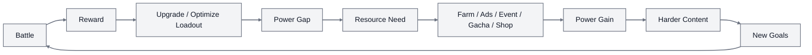
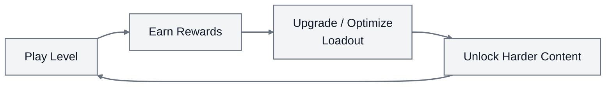

# 1945 Air Force - Design Deconstruction

## 1. Executive Summary

1945 Air Force là một game mobile vertical shoot 'em up: người chơi điều khiển máy bay bằng thao tác kéo/chạm, game tự động bắn, người chơi tập trung vào né đạn, vượt wave, đánh boss và nhận thưởng sau mỗi trận.


Luận điểm chính của bản deconstruction này:

> 1945 Air Force tồn tại lâu nhờ tập trung mở rộng chiều sâu progression/meta như nâng cấp, sưu tập, gear, event và economy, trong khi vẫn giữ trải nghiệm combat arcade quen thuộc, dễ hiểu và dễ quay lại.

Combat của game đơn giản:

- Kéo máy bay để né.
- Auto-fire liên tục.
- Màn chơi ngắn.
- Đạn, nổ, loot và boss tạo cảm giác arcade mạnh.

Nhưng thứ giữ người chơi lại nằm ở phần meta:

- Nhiều unit để sở hữu và đầu tư: Aircraft, Wingman, Device, Co-pilot, Pilot.
- Nhiều trục tăng power: upgrade, promote, tier merge, gear, engine, certificate.
- Nhiều tài nguyên: Gold, Gems, Modules, Wrenches, Chips, Beer, Towels, Fuel, event currency.
- Nhiều routine quay lại: daily gift, daily mission, event, PvP, clan, collection.
- Nhiều điểm monetization: rewarded ads, interstitial ads, revive, IAP pack, VIP, battle pass, gacha, limited offer.

Bản deconstruction này phân tích cách 1945 Air Force tổ chức các hệ thống như máy bay, gear, event, VIP, economy và monetization thành một vòng lặp liên tục: người chơi vào combat, nhận reward, dùng reward để nâng cấp, gặp nhu cầu tài nguyên mới, rồi được dẫn sang farm, event, ad, gacha hoặc shop trước khi quay lại combat mạnh hơn.



Đây là operating model của 1945 Air Force.

## 2. Core Operating Model

1945 Air Force vận hành theo core loop:



Với người chơi, loop này diễn ra rất nhanh: mở game, bấm vào màn chơi, kéo máy bay để né đạn, xem máy bay tự bắn, kết thúc trận và nhận phần thưởng. Một session có thể chỉ kéo dài vài phút nhưng vẫn tạo cảm giác có tiến triển, vì sau trận người chơi thường có thêm tài nguyên để nâng cấp hoặc tiến gần hơn tới mục tiêu tiếp theo.

Điểm quan trọng là game không bắt người chơi học quá nhiều trước khi thấy vui. Họ chỉ cần hiểu một hành động chính: di chuyển máy bay để sống sót. Phần tấn công đã được auto-fire xử lý, nên độ khó tập trung vào việc đọc đạn, tìm khoảng trống an toàn và né đúng thời điểm.

Ở mức meta, loop này sâu hơn:

```text
Combat Result
-> Gold / Gems / Modules / Materials
-> Aircraft / Wingman / Device / Gear / Engine upgrade
-> Power tăng
-> Mission khó hơn / difficulty cao hơn / boss khó hơn
-> Resource requirement mới
```

Reward luôn được gắn với một nhu cầu đầu tư tiếp theo. Nếu người chơi có Gold, họ có thể upgrade. Nếu thiếu Modules, họ phải đi campaign, event hoặc shop. Nếu thiếu Wrenches, họ phải farm daily, tournament hoặc event. Nếu muốn gear tốt hơn, họ bị kéo vào Gear Machine/gacha.

Nói cách khác, mỗi màn chơi là một bước nhỏ: tích lũy thêm resource, nâng thêm một chút power, tiến gần hơn tới content khó hơn.

Operating model có 4 lớp:

| Lớp                    | Vai trò                                                           |
| ---------------------- | ----------------------------------------------------------------- |
| Core combat            | Tạo fun tức thời và nguồn reward                                  |
| Meta progression       | Tạo mục tiêu ngắn, trung và dài hạn                               |
| Economy routing        | Quyết định người chơi phải làm gì khi thiếu resource              |
| LiveOps / monetization | Biến nhu cầu tiến bộ thành thói quen quay lại và trigger chi tiền |

Combat tạo reward, reward tạo nhu cầu upgrade, nhu cầu upgrade giữ người chơi quay lại và mở ra điểm chi tiền. Toàn bộ game xoay quanh vòng này.

## 3. Systems Breakdown

### 3.1 Core Combat System

Core combat của 1945 Air Force gồm 5 thành phần chính:

- One-thumb movement: người chơi kéo hoặc chạm để di chuyển máy bay.
- Auto-fire: game tự động bắn, người chơi không cần giữ nút fire.
- Active skills: aircraft skill và device skill, người chơi bấm kích hoạt giữa trận. Loại skill sẽ phụ thuộc loadout đang sử dụng.
- Bullet dodge: thử thách chính là đọc đạn, né đạn, nắm hitbox.
- Wave/boss structure: level gồm wave địch, power-up và boss có pattern.


Auto-fire giảm execution burden trên mobile. Màn hình cảm ứng nhỏ, nếu vừa phải bắn vừa phải né, control sẽ nặng. 1945 Air Force cắt bớt nút bắn để người chơi tập trung vào positioning.

Skill expression đến từ dodge và timing: hitbox nhỏ hơn sprite, bullet pattern ngày càng dày, boss có phase và telegraph.


Core combat đóng vai trò engine tạo reward. Mỗi lần người chơi chơi một màn, game có cơ hội:

- Trả reward.
- Kích hoạt ad/revive.
- Đẩy người chơi về upgrade.
- Tạo cảm giác thiếu một chút nữa là qua, dẫn tới nhu cầu tăng power.

Rủi ro của combat là readability. Khi bullet, player shot, explosion, loot và background chồng lên nhau, người chơi có thể chết mà không hiểu vì sao. Với shmup, điều này rất nguy hiểm: khó thì chấp nhận được, nhưng không đọc được thì dễ bị cảm giác bất công.

### 3.2 Loadout / Content System

1945 Air Force có nhiều loại đối tượng để người chơi sở hữu và build:

- Aircraft: unit chính người chơi điều khiển.
- Wingman: hỗ trợ bắn, mở rộng damage footprint.
- Device: hỗ trợ utility/burst trong battle.
- Co-pilot: nhân vật hỗ trợ stat và skill.
- Pilot: nhân vật chính có gear riêng.


Mỗi loại unit là một **investment surface** — thêm một nơi để người chơi đổ resource vào.

Aircraft có nhiều lớp đầu tư:

- Star/upgrade.
- Gear slot.
- Engine.
- Certificate.
- Skin có stat bonus.


Wingman và Device cũng có gear/engine riêng. Pilot lại có body gear và multiplier stat riêng. Kết quả là người chơi gần như luôn có một thứ gì đó để nâng cấp, tối ưu, thay thế, merge hoặc farm.


Vai trò của Loadout System:

| Vai trò              | Tác dụng                                                |
| -------------------- | ------------------------------------------------------- |
| Collection           | Tạo mục tiêu sở hữu nhiều aircraft, wingman, device     |
| Build depth          | Người chơi phải chọn unit, damage type, gear, synergy   |
| Resource sink        | Mỗi unit mở thêm nơi tiêu Gold, Modules, Wrenches, Gems |
| Long-term retention  | Người chơi khó cảm thấy "xong hết"                      |
| Monetization surface | Pack, gacha, event reward, VIP advantage có đất để bán  |

Điểm mạnh của cách thiết kế này là combat core không cần thay đổi quá nhiều, nhưng game vẫn có cảm giác sâu hơn theo thời gian. Điểm yếu là complexity tăng rất nhanh. Nếu mở quá nhiều hệ thống sớm, người mới sẽ thấy dashboard và loadout như một ma trận.

### 3.3 Progression System

Progression của 1945 Air Force không nằm trên một trục duy nhất. Game chia power growth thành nhiều lớp:

- Upgrade bằng Gold.
- Promote bằng Modules.
- Tier Merge bằng unit max star + Gems.
- Gear upgrade bằng Wrenches/Gems và merge rarity.
- Engine upgrade bằng Wrenches + Engine Batteries.
- Pilot gear bằng Towels/Gems.
- Certificate bằng chuỗi mission riêng.


Thiết kế này giải quyết một vấn đề lớn của F2P: nếu chỉ có một đường upgrade, người chơi sẽ nhanh chạm trần. 1945 Air Force tạo nhiều đường upgrade để khi một đường bị chậm lại, người chơi vẫn còn đường khác để theo.

Ví dụ:

```text
Hết Gold -> farm Campaign/Daily
Thiếu Modules -> Campaign/Event/Shop
Thiếu Gear -> Gear Machine hoặc Event
Thiếu Wrenches -> Daily/Tournament/Event
Cần Tier mới -> cần 2 unit max star + Gems
Cần stat nâng cao -> Gear/Engine/Certificate
```

Game luôn tạo ra next goal:

- Mục tiêu ngắn hạn: nâng thêm 1 level, thêm 1 star, clear level tiếp theo.
- Mục tiêu trung hạn: unlock gear slot, promote unit, hoàn thành daily shop.
- Mục tiêu dài hạn: merge lên tier cao, max gear rarity, làm certificate, sưu tập unit/skin.

Điểm mạnh: người chơi luôn có việc để làm.

Điểm yếu: nếu resource cost tăng quá nhanh, progression wall dễ bị cảm nhận như paywall. Người chơi không còn thấy mình cần chơi tốt hơn, mà thấy mình bị bắt farm hoặc mua.


### 3.4 Economy System

Economy của 1945 Air Force gồm nhiều currency và material:

- Gold: soft currency cho upgrade.
- Gems: hard currency cho revive, merge, elite gear, gacha, skip, shop.
- Modules: promote unit.
- Wrenches: gear/engine upgrade.
- Engine Batteries: engine upgrade, scarce/event-gated.
- Chips: Gear Machine/gacha.
- Beer: pity/material từ failed spin hoặc disassemble.
- Towels: pilot gear upgrade.
- Medals: PvP/tournament shop.
- Fuel/Dog Tags: gate attempt/session.
- Event currency: dùng trong event shop, hết giá trị sau event.

Economy **route behavior**: khi thiếu resource, game dẫn người chơi sang hành vi khác.

Ví dụ:

```text
Thiếu Gold -> replay/farm Campaign, Daily, ad crate
Thiếu Modules -> Campaign difficulty, Event, Module shop
Thiếu Wrenches -> Daily Mission, Tournament, Event
Thiếu Gear -> Gear Machine, Chips, Beer shop
Thiếu Gems -> campaign reward, ad, IAP
Thiếu Event item -> chơi event/campaign trong thời gian event
```

Battle tạo resource. Resource tiêu vào progression. Khi resource thiếu, game mở ra daily/event/shop/ad/gacha. Economy biến nhu cầu mạnh hơn thành lý do quay lại hoặc chi tiền.


Điểm mạnh của economy là mỗi resource có vai trò riêng, giúp game điều tiết progression tốt. Điểm yếu là cognitive load: người chơi mới có thể không biết Chips, Beer, Wrenches, Batteries, Modules khác nhau thế nào và nên farm cái nào trước.

### 3.5 Retention / LiveOps System

Retention của 1945 Air Force nằm ở việc game tạo nhiều lý do quay lại:

- Daily Gift.
- Daily Missions.
- Free ad crates.
- Seasonal/Holiday Events.
- Special Events.
- New Pilot Event.
- PvP/Tournament.
- Clan/Division.
- Long-term collection.
- Certificate và tier merge.


Thiết kế hay ở đây là LiveOps không cần tạo lại combat core. Đa số event/daily vẫn dựa trên việc chơi, farm, nhận currency, đổi thưởng. Game chỉ thay đổi wrapper:

```text
Cùng là combat
-> hôm nay chơi để lấy Gold
-> ngày mai chơi để lấy event item
-> cuối tuần chơi để leo rank/tournament
-> event mới chơi để lấy skin/aircraft độc quyền
```

Retention có thể chia thành 3 tầng:

| Tầng       | Cơ chế                                                |
| ---------- | ----------------------------------------------------- |
| Short-term | Battle ngắn, reward liên tục, upgrade gần             |
| Mid-term   | Daily missions, gear farming, campaign gates          |
| Long-term  | Collection, tier merge, certificate, events, clan/PvP |

Người chơi quay lại vì daily checklist, event timer, collection gap, upgrade target và áp lực social/competitive.


Rủi ro là dashboard clutter. Khi có quá nhiều event, badge, offer, shop, mission, người mới dễ bị quá tải và không biết nên ưu tiên việc nào.

### 3.6 Monetization System

1945 Air Force dùng hybrid monetization:

- Rewarded ads: revive, reward, free crates.
- Interstitial ads: chen sau campaign/map.
- IAP packs: gems, resource, limited offers.
- Popup offers: star upgrade (ví dụ 3 star → 10 star bằng Gems), promotion mua aircraft, nâng cấp giá rẻ cho tài khoản mới. Xuất hiện khi mở game, sau mỗi trận, khi vào menu — lặp lại liên tục.
- VIP: lifetime spending ladder.
- Battle Pass: premium reward track.
- Gacha/Gear Machine: chips -> gear/beer pity.
- Webshop/direct purchase.


Điểm quan trọng: monetization được gắn vào **desire state** của người chơi.

| Player state           | Monetization trigger                |
| ---------------------- | ----------------------------------- |
| Chết giữa trận         | Revive bằng ad hoặc Gems            |
| Thiếu resource         | Pack, ad crate, daily grind         |
| Muốn gear tốt          | Gear Machine/gacha                  |
| Muốn tiến nhanh        | VIP, battle pass, IAP               |
| Sợ lỡ event reward     | Limited offer/event pack            |
| Khó chịu vì pop-up ads | Mua lần đầu để giảm/bỏ interstitial |
| Vừa xong trận / mở game | Popup offer star upgrade, promotion pack |

1945 Air Force không cần khóa content cứng sau paywall. Thay vào đó, game bán tốc độ, convenience, attempt và advantage. F2P vẫn có thể chơi tiếp, nhưng chậm hơn. Heavy spender tiến nhanh hơn và lợi thế cộng dồn: VIP stat bonus -> clear khó hơn -> nhận reward tốt hơn -> upgrade nhanh hơn -> lại clear khó hơn.

Điểm mạnh: monetization bám vào nhu cầu đã tồn tại trong core loop. Điểm yếu: nếu advantage cộng dồn quá mạnh, PvP/leaderboard dễ bị cảm nhận là pay-to-win. Popup offer xuất hiện quá thường xuyên (mở game, xong trận, vào menu) cũng gây khó chịu — người chơi không muốn mua vẫn bị ép nhìn liên tục.


## 4. System Connection Map

Phân tích từng system riêng lẻ chưa đủ. Phần này cho thấy cách chúng nối với nhau.

Bản đồ hệ thống của 1945 Air Force:

```text
Core Combat
  -> tạo Battle Result
  -> tạo Reward

Reward
  -> đổ vào Progression
  -> tăng Aircraft/Wingman/Device/Pilot power

Progression
  -> giúp clear content khó hơn
  -> tạo Power Gate mới
  -> tạo Resource Need

Resource Need
  -> dẫn sang Economy Source
  -> Campaign / Daily / Event / PvP / Clan / Ad / Shop / Gacha

LiveOps
  -> thay đổi lý do farm mỗi ngày/tuần
  -> thêm event currency và exclusive reward

Monetization
  -> bán lời giải cho friction:
     revive, resource shortage, slow progress, ad annoyance, event pressure
```

Nếu viết ngắn gọn:

```text
Combat tạo reward.
Reward tạo upgrade.
Upgrade tạo power.
Power gap tạo nhu cầu resource.
Resource shortage tạo lý do farm/quay lại/chi tiền.
LiveOps làm mới lý do quay lại.
Monetization bán cách đi nhanh hơn qua các điểm nghẽn.
```

Các hệ thống của 1945 Air Force chạy cùng nhau như một bộ máy, không phải danh sách feature rời.

## 5. Retention Analysis

### 5.1 Short-term Retention

Short-term retention đến từ việc game cho người chơi vào fun rất nhanh:

- Control đơn giản.
- Stage ngắn.
- Bắn/nổ/loot liên tục.
- Reward sau trận rõ.
- Upgrade có thể đến sớm.

Người chơi mới không cần hiểu hết meta system để thấy vui. Họ chỉ cần né đạn, thấy máy bay bắn, thấy địch nổ, nhận thưởng và nâng cấp. Fun đến trước, complexity mở sau.

### 5.2 Mid-term Retention

Mid-term retention đến từ các power gate và daily routine:

- Campaign ngày càng khó.
- Cần upgrade/promote để clear tiếp.
- Daily missions cho targeted resource.
- Gear/engine tạo thêm mục tiêu farm.
- Event currency tạo việc cần làm trong thời gian ngắn.

Ở giai đoạn này, người chơi bắt đầu hiểu muốn tiến xa thì phải quản lý resource và loadout, chơi tốt thôi chưa đủ.

### 5.3 Long-term Retention

Long-term retention đến từ các mục tiêu khó hoàn thành:

- 60+ aircraft và nhiều unit support.
- Tier merge lên T2/T3/T4.
- Max gear rarity/star.
- Certificate theo từng aircraft.
- Event-exclusive skins/aircraft.
- Clan/PvP/status/leaderboard.

1945 Air Force chạy kiểu infinite treadmill: khi một trục progression gần max, game còn trục khác — aircraft -> wingman -> device -> gear -> engine -> pilot gear -> certificate -> skin/event.

Rủi ro của cách này là metagame có thể phình to quá mức. Nếu người chơi không nhìn thấy next best action, retention hook sẽ biến thành confusion.

## 6. Monetization Analysis

1945 Air Force kiếm tiền tốt vì nó đặt monetization vào đúng thời điểm người chơi có nhu cầu.

### 6.1 Revive Monetization

Người chơi chết giữa trận, đã đổ thời gian và cảm xúc vào run đó. Revive bằng ad hoặc Gems đúng lúc: "muốn cứu run này không?" Ad placement mạnh vì nó xuất hiện đúng khi người chơi đang muốn, không phải random.

### 6.2 Resource Monetization

Khi người chơi thiếu Gold, Gems, Modules, Wrenches, Chips hoặc Batteries, game có thể đưa ra nhiều đường:

- Farm tiếp.
- Xem ad.
- Đổi event/shop.
- Mua pack.
- Quay gacha.

Monetization kiểu speed wall: không chặn tuyệt đối, nhưng làm chậm.

### 6.3 VIP / Battle Pass

VIP và Battle Pass nhắm vào người chơi đã có engagement. Nếu người chơi đã vào daily routine, VIP/Battle Pass trở thành cách hợp lý hóa spending: mua để nhận thêm reward, thêm attempt, tăng stat, giảm friction.

### 6.4 Gacha / Gear Machine

Gear Machine gắn gacha với power thay vì chỉ cosmetic. Chips tạo pull, gear tạo stat, Beer làm pity để failed pull vẫn có giá trị. Kể cả không trúng, người chơi vẫn tích lũy được gì đó.

### 6.5 Fairness Risk

Điểm rủi ro là spending advantage cộng dồn. VIP tăng stat/attempt, gear/gacha tăng power, event skin có stat bonus. Trong PvE, điều này có thể được chấp nhận như pay-to-progress. Trong PvP/leaderboard, nó dễ bị cảm nhận là pay-to-win.

## 7. Game Flow / Player Journey

Trong bản này, không cần gọi là UX như folder cũ. Phần này nên hiểu là **Game Flow**: các màn hình, popup và đường đi nối các hệ thống với nhau.

Flow chính:


```text
Dashboard
-> Pre-battle
-> Battle
-> Result
-> Reward / Ad
-> Dashboard
```

Flow progression:

```text
Dashboard
-> Squadron / Unit screen
-> Aircraft / Wingman / Device / Pilot
-> Gear / Engine / Upgrade / Certificate
-> Missing resource
-> Source: Campaign / Daily / Event / Shop / Gacha
-> Return to upgrade
```

Flow liveops:

```text
Dashboard badge / timer
-> Daily Gift / Mission / Event
-> Play / Claim / Earn currency
-> Event shop / Mission shop
-> Exchange reward
-> Back to loadout/progression
```

Flow monetization:

```text
Death -> Revive ad/Gems
Result -> Interstitial / rewarded offer
Shop -> Free crate / Money / Container / Module
Resource shortage -> Pack / Gacha / Event offer
```

Flow tốt thì người chơi biết mình đang ở đâu, thiếu gì, nên làm gì tiếp. Flow tệ thì cùng bộ system đó trở thành clutter.

Với 1945 Air Force, điểm mạnh là Quick Play và battle entry nhanh. Điểm yếu tiềm ẩn là late-game dashboard có quá nhiều nút, badge, offer và system entry point.

## 8. Strengths & Weaknesses

### Strengths

**1. Simple input, strong accessibility**

Auto-fire và one-thumb movement làm game dễ vào. Người chơi mới có thể hiểu combat trong vài giây, nhưng vẫn có skill qua dodge, hitbox và boss pattern.

**2. Combat core được tái sử dụng tốt**

Campaign, daily, event, boss, PvP/competitive đều có thể dùng cùng nền combat. Game không cần tạo gameplay mới cho mỗi mode, chỉ cần đổi mục tiêu và reward wrapper.

**3. Nhiều investment surfaces**

Aircraft, Wingman, Device, Pilot, Gear, Engine, Certificate tạo ra nhiều nơi tiêu resource. Điều này giúp reward sau battle có ý nghĩa lâu dài.

**4. Retention nhiều tầng**

Game có short-term reward, mid-term daily/progression, long-term collection/tier/event. Nhiều tầng này giúp người chơi có lý do quay lại ở các mốc engagement khác nhau.

**5. Monetization bám vào desire state**

Revive, resource shortage, event FOMO, VIP speed-up, ad removal đều gắn với nhu cầu rõ của người chơi.

### Weaknesses / Risks

**1. Complexity overload**

Quá nhiều unit, gear, engine, currency, event và shop có thể làm người mới bị ngợp.

**2. Combat readability**

Bullet, explosion, pickup, player shot và boss VFX có thể làm mất rõ hitbox hoặc lethal threat.

**3. Paywall perception**

Nếu progression cost tăng nhanh hơn earn rate quá nhiều, người chơi dễ cảm thấy bị ép mua thay vì được thử thách.

**4. Currency confusion**

Nhiều resource có vai trò gần nhau nhưng source/sink khác nhau. Nếu UI không chỉ rõ kiếm ở đâu, người chơi sẽ lạc.

**5. Stat cosmetics / VIP advantage**

Cosmetic có stat bonus và VIP cộng dồn power có thể làm competitive fairness yếu đi.

## 9. Transferable Lessons

**Lesson 1: Giữ core action đơn giản trước khi thêm meta depth**

1945 Air Force cho thấy một combat input đơn giản vẫn có thể sống lâu nếu meta progression đủ sâu. Đừng bắt người chơi học quá nhiều điều trước khi họ thấy fun.

**Lesson 2: Content nên là investment surface**

Aircraft/Wingman/Device là nơi người chơi đổ resource, tối ưu build và tạo mục tiêu dài hạn.

**Lesson 3: Mỗi resource nên route một hành vi**

Gold, Modules, Wrenches, Chips, Beer đẩy người chơi sang campaign, daily, event, gacha, shop — mỗi resource mở một đường đi riêng.

**Lesson 4: LiveOps có thể tái sử dụng core gameplay**

Không cần mỗi event là một gameplay mới. Có thể giữ combat core, nhưng đổi reward, currency, timer và mục tiêu để tạo lý do quay lại.

**Lesson 5: Monetization nên gắn với desire state**

Offer mạnh nhất xuất hiện khi người chơi đã có nhu cầu: chết muốn revive, thiếu resource, muốn event reward, muốn tiến nhanh, muốn bỏ ads.

**Lesson 6: Complexity phải được stage**

Nhiều system giúp game sống lâu, nhưng phải mở theo nhịp. Nếu đẩy tất cả vào dashboard quá sớm, depth sẽ biến thành noise.

**Lesson 7: Difficulty phải đọc được**

Bullet hell có thể khó, nhưng người chơi phải hiểu vì sao mình chết. Readability là điều kiện để difficulty được cảm nhận là công bằng.

## 10. Appendix / Evidence Plan

Folder `1945-air-force-deconstruction` được dùng làm reference/evidence bank. Khi biến bản này thành portfolio hoàn chỉnh, cần gắn mỗi insight với screenshot, bảng số liệu hoặc observation cụ thể.

Evidence nên bổ sung:

| Cần chứng minh                | Evidence nên có                                           |
| ----------------------------- | --------------------------------------------------------- |
| Battle core dễ vào            | Screenshot/video early battle, control, HUD               |
| Readability risk              | Screenshot late/busy battle hoặc boss                     |
| Loadout là investment surface | Aircraft/Wingman/Device screen, gear/engine/certificate   |
| Progression wall              | Bảng cost vs reward, upgrade/promote requirement          |
| Economy routing               | Screenshot missing resource/source/shop                   |
| Retention loop                | Daily gift, daily mission, event shop, timer              |
| Monetization trigger          | Revive prompt, shop, VIP, free ad crate, battle pass      |
| Game flow                     | Flowchart dashboard -> battle -> result -> upgrade/source |

Bảng/phụ lục nên có:

- Core loop diagram.
- System connection map.
- Currency source/sink table.
- Upgrade cost sample.
- IAP/ad placement table.
- Daily/event task table.
- Strength/weakness evidence table.

Mục tiêu là mỗi kết luận trong deconstruction đều có evidence đi kèm, không nhận định suông.
